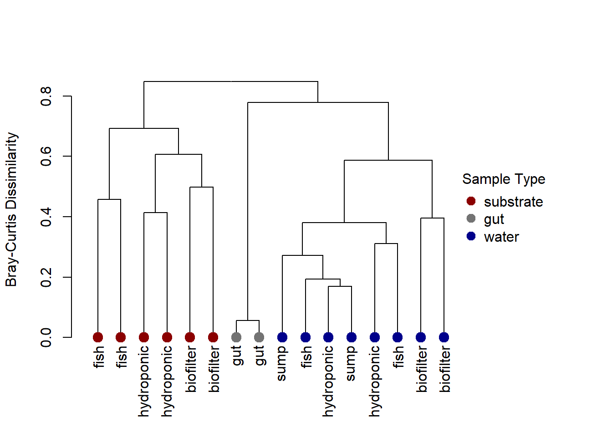
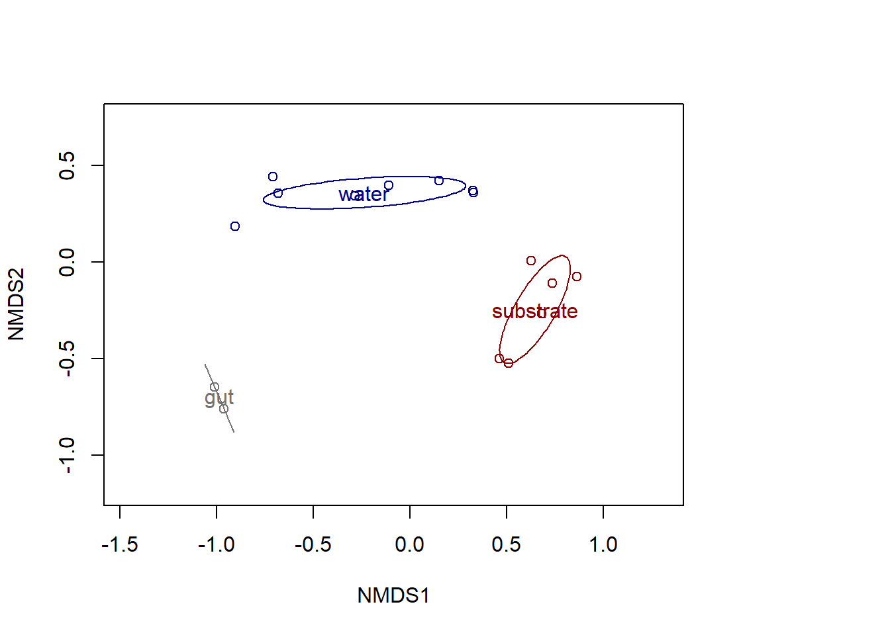
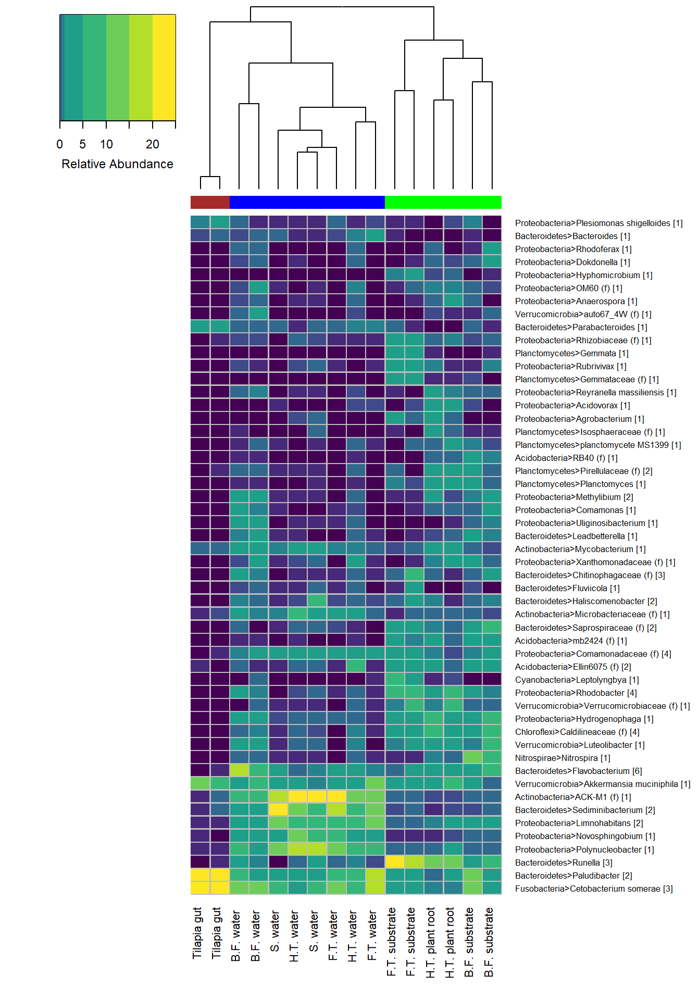

## Import

get qiime files into R. I use *Phyloseq* to 

- clean up irregularites in taxonomy table
- remove ASVs associated with mitochondria and chloroplast
- rename ASV (e.g. ASV1, ASV2, etc.)
- make transformation to ratios
- normalize via rarefaction


```r
library("biomformat")
library("phyloseq")
library("ggplot2")
library("Biostrings")
library("tidyverse")
library("gridExtra")
library("vegan")

tree = "tree.nwk"
map = "meta.txt"
repseq = "dna-sequences.fasta"
biom = read_biom("table-with-taxonomy.biom")
data = import_biom(biom, tree, parseFunction = parse_taxonomy_greengenes)

#update and fix sample_data
meta = import_qiime_sample_data(map)
sample_data(data) = meta

#reference sequences
bs = readDNAStringSet(repseq)
data = merge_phyloseq(data, bs)

#remove mistaken taxanomic ranks
tax_table(data) <- tax_table(data)[, 1:7]

#remove chloroplasts & mitochondria
data = subset_taxa(data, Family != "Mitochondria" & Class != "Chloroplast" & Family != "mitochondria" )

#rename OTU names
taxa_names(data) = paste0("ASV",seq(ntaxa(data)))

#transform abundance to ratio
data_r = transform_sample_counts(data, function(x) 100* x/sum(x))

#rarefy to min. sequence count
rngseed1=100
data_rarefy = rarefy_even_depth(data, sample.size = min(sample_sums(data)), rngseed = rngseed1, replace = TRUE, trimOTUs = TRUE, verbose = TRUE)
data_rarefy_r = transform_sample_counts(data_rarefy, function(x) 100* x/sum(x))
```

```r
sequence_sum = sample_sums(data)
otu_sum = apply(otu_table(data)>0, 2, sum)
sample_info = as.data.frame(cbind(as(sample_data(data), "matrix"), sequence_sum, otu_sum)) %>%
  select(Tank, Type, sequence_sum, otu_sum)%>%
  rename(Sequences = sequence_sum, ASVs = otu_sum)

#reorder rows
slist = paste0(rep("sample-", times = 16), seq.int(1,16), "")
sample_info = sample_info[slist,]
```

There was a total of 296,234 quality filtered reads and 505 ASVs in the data set. The average reads per sample was 18,514.62 The lowest count was 6,983 in sample 10 and the highest was 41,282 in sample 1. An overview of the samples is shown in the following table.

<div data-pagedtable="false">
  <script data-pagedtable-source type="application/json">
{"columns":[{"label":[""],"name":["_rn_"],"type":[""],"align":["left"]},{"label":["Tank"],"name":[1],"type":["fctr"],"align":["left"]},{"label":["Type"],"name":[2],"type":["fctr"],"align":["left"]},{"label":["Sequences"],"name":[3],"type":["fctr"],"align":["left"]},{"label":["ASVs"],"name":[4],"type":["fctr"],"align":["left"]}],"data":[{"1":"gut","2":"gut","3":"41282","4":"64","_rn_":"sample-1","_row":"sample-1"},{"1":"gut","2":"gut","3":"38820","4":"72","_rn_":"sample-2","_row":"sample-2"},{"1":"fish","2":"water","3":"26779","4":"123","_rn_":"sample-3","_row":"sample-3"},{"1":"fish","2":"water","3":"26180","4":"136","_rn_":"sample-4","_row":"sample-4"},{"1":"fish","2":"substrate","3":"11389","4":"241","_rn_":"sample-5","_row":"sample-5"},{"1":"fish","2":"substrate","3":"13490","4":"226","_rn_":"sample-6","_row":"sample-6"},{"1":"hydroponic","2":"water","3":"12424","4":"251","_rn_":"sample-7","_row":"sample-7"},{"1":"hydroponic","2":"water","3":"21972","4":"192","_rn_":"sample-8","_row":"sample-8"},{"1":"hydroponic","2":"substrate","3":"10080","4":"266","_rn_":"sample-9","_row":"sample-9"},{"1":"hydroponic","2":"substrate","3":"6983","4":"315","_rn_":"sample-10","_row":"sample-10"},{"1":"biofilter","2":"water","3":"9655","4":"256","_rn_":"sample-11","_row":"sample-11"},{"1":"biofilter","2":"water","3":"14918","4":"286","_rn_":"sample-12","_row":"sample-12"},{"1":"biofilter","2":"substrate","3":"9425","4":"309","_rn_":"sample-13","_row":"sample-13"},{"1":"biofilter","2":"substrate","3":"11276","4":"301","_rn_":"sample-14","_row":"sample-14"},{"1":"sump","2":"water","3":"25560","4":"147","_rn_":"sample-15","_row":"sample-15"},{"1":"sump","2":"water","3":"16001","4":"194","_rn_":"sample-16","_row":"sample-16"}],"options":{"columns":{"min":{},"max":[10]},"rows":{"min":[10],"max":[10]},"pages":{}}}
  </script>
</div>


## Rarefaction

Rarefaction curves were produced using *vegan* function *rarecurve*. Each curve shows the number of ASVs or bacteria species found in a sample at different sequence counts. As the number of 16S sequences increases, the slope of all curves approach zero. This indicates that the sampling depth was satisfactory and the samples are a fair representation of the bacteria community


```r
library(vegan)

#function to transpose phyloseq OTU table into vegan OTU matrix 
veganotu = function(physeq) {
  require("vegan")
  OTU = otu_table(physeq)
  if (taxa_are_rows(OTU)) {
    OTU = t(OTU)
  }
  return(as(OTU, "matrix"))
}

#transpose phyloseq table to vegan-compatible matrix 
rcurve_data = veganotu(data)

#xlimit at median sequences
r = rarecurve(rcurve_data, step = 20, xlab = "16S Sequences", ylab = "ASVs", label = FALSE, xlim = c(0,17633))
```

<!-- -->

## Alpha Diversity
Richness and Eveness were used to compare the diversity within samples. Richness refers to the number of ASVs or species and eveness to how they are distrbuted. Pielou’s eveness index $$J=H/ln(S)$$ was derived using *vegan* function *diversity*. 


```r
#function to transpose phyloseq OTU table into vegan OTU matrix 
veganotu = function(physeq) {
  require("vegan")
  OTU = otu_table(physeq)
  if (taxa_are_rows(OTU)) {
    OTU = t(OTU)
  }
  return(as(OTU, "matrix"))
}

#use rarefied counts
v_data = veganotu(data_rarefy)

#get sum of ASV's for each sample
rich = specnumber(v_data)

#Shannon diversity score
H = diversity(v_data, index = "shannon")

#Pielous's Eveness
J <- H/log(specnumber(v_data))

#make table 
x = as.data.frame(cbind(as(sample_data(data), "matrix"), H, J, rich))
x$H = as.numeric(as.character(x$H))
x$J = as.numeric(as.character(x$J))
x$rich = as.numeric(as.character(x$rich))


p = ggplot(x, aes(x = Type, y = rich))+
  geom_boxplot(coef =4, alpha = 0.5)+
  geom_jitter(color = "black", size = 0.6, alpha = 0.9)+
  ylab("Richness")+
  xlab("")

pp = ggplot(x, aes(x = Type, y = H))+
  stat_boxplot(coef = 4, alpha = 0.5)+
  geom_jitter(color = "black", size = 0.6, alpha = 0.9)+
  ylab("Pielous's Evenness")+
  xlab("")
grid.arrange(p,pp, nrow = 1)
```

<!-- -->

Overall, the substrate environment had greater diversity than the water environment. The gut was signficantly less diverse than water and substrate enivornments. 


## Beta Diversity

### Hierarchical cluster analysis

Hierarachcical clustering of Bray-Curtis dissimilarity matrix using Average-linkage method from package *hclust* shows clustering of samples by Type. Substrate samples from the same tank form discrete clusters while water samples are more ambigious. 


```r
source('C:/Users/dlifg/Desktop/aquaponics sequence data/QIIME files/qiime2/scripts/plot_dendrogram.R')
plot_dendrogram(data_rarefy,"average", "Tank")
```

<!-- -->

### Non-metric dimensional scaling (NMDS)

NMDS ordination of Bray-Curtis distance using *vegan* function *metaMDS* with dimensions, k = 5 and stress = 0.012. Ellipses 
validates hierarchical clustery of samples by Type. 


```r
#convert phyloseq sample data into data frame
v_meta = as.data.frame(as.matrix(sample_data(data_rarefy)))

#picked 5 dimenstions (k = 5) as stress 
bc.nmds = metaMDS(v_data, distance = "bray", k = 5, trymax = 100) 

par(mar=c(5.1, 4.1, 4.1, 8.1), xpd=TRUE)
plot(bc.nmds, type = "n")
points(bc.nmds, display = "sites", col=c("grey45","darkred", "darkblue")[v_meta$Type])
ordiellipse(bc.nmds, groups = v_meta$Type, kind = "se", conf = .99, draw = "lines", col = c("grey45","darkred", "darkblue"), label = TRUE, alpha = 100)
```

<!-- -->

```r
#legend("topright", legend = c("gut", "substrate", "water"), col = c("grey45","darkred", "darkblue"), 
#       pch=20, inset = c(-0.2,0), title = "Sample Type", y.intersp = 1, x.intersp = 1, bty = "n", pt.cex = 2)
```

### Adonis


```r
doadonis <- function(physeq, category, distance) {
  bdist <- phyloseq::distance(physeq, distance)
  col <- as(sample_data(physeq), "data.frame")[ ,category]
  
  # Adonis test -- do the centroid differ according to category (i.e sampele type)
  adonis.bdist <- adonis(bdist ~ col)
  print("Adonis results:")
  print(adonis.bdist)
  
  # Homogeneity of dispersion test -- does the variance of the communties differ according to category (i.e. sample type)
  betatax = betadisper(bdist,col)
  p = permutest(betatax)
  print("Betadisper results:")
  print(p$tab)
}

doadonis(data_rarefy, "Type", "bray")
```

```
## [1] "Adonis results:"
## 
## Call:
## adonis(formula = bdist ~ col) 
## 
## Permutation: free
## Number of permutations: 999
## 
## Terms added sequentially (first to last)
## 
##           Df SumsOfSqs MeanSqs F.Model      R2 Pr(>F)    
## col        2    2.3495 1.17475  8.7922 0.57495  0.001 ***
## Residuals 13    1.7370 0.13361         0.42505           
## Total     15    4.0865                 1.00000           
## ---
## Signif. codes:  0 '***' 0.001 '**' 0.01 '*' 0.05 '.' 0.1 ' ' 1
## [1] "Betadisper results:"
##           Df    Sum Sq   Mean Sq        F N.Perm Pr(>F)
## Groups     2 0.2151814 0.1075907 9.150813    999  0.006
## Residuals 13 0.1528475 0.0117575       NA     NA     NA
```

## Composition

### Phylum-level

Bar plots showing the abundance of phyla was generated in *ggplot*. Any phyla contributing less than 1% of total abundance in any one sample were grouped together in category: **<1%**.


```r
source('C:/Users/dlifg/Desktop/aquaponics sequence data/QIIME files/qiime2/scripts/plot_phylum.R')
plot_phylum(data_rarefy_r)
```

<!-- -->

In total, 15 different phyla were identified with 11 contributing over 99% of the abundance in any given sample. Bacteriodetes, Proteobacteria, Fusobacteria, Verrucomicrobia, and Actinobacteria were the most prevelant in all samples but differences were seen in the different environment types. Proteobacteria made up  only 1%-2% of the gut community but were enriched in water and substrate environments making up between 22% - 44% of the community. Actinobacteria was prevelent in the water environment (19% average abundance) but much less so in substrate enivornment (2% average abundance). Planctomycetes, Chlorflexi, and Acidobacteria on the other hand were more prevelant in the substrate environment. Only Nitrospirae showed any tank specific localization, as it was only prevelant in the biofilter substrate site. 

### ASV-level

Heatmat generated with *heatmap.2* shows the general composition of the system. Only ASV's making up at least 1% of the abundance in any single sample are included. Samples (columns) are ordered by clustering of Bray-Curtis dissimilarity of the samples entire community. ASVs (rows) are ordered by Euclidean distance based clustering. Phylum and the highest taxonomic level is shown for each ASV. The number in brackets indicate the number of ASVs with identical taxonomy.


```r
source('C:/Users/dlifg/Desktop/aquaponics sequence data/QIIME files/qiime2/scripts/ASV_heatmap.R')
hmap(data_rarefy_r,1)
```

<!-- -->

Looking at the community at a higher taxonomic resolution shows a clearer picture of which taxa are different in the gut, water, and substrate environments. The gut was dominanted by species Cetobacterium somerae, Akkermansia muciniphila and genre Paludibacter, Parabacteroides, all of which are known to be anaerobic -- a good indicator that these are true gut microbes. C.somerae has been well documented in the gut of freshwater fish such as Nile tilpia **@Tsuchiya2008a** and has been identified in aquaponic systems **@Schmautz2017**. It was abundant in the water environment throughout our system ranging from 4% in the hydroponic tank to 16% in the fish tank. This falls in line with another study which found C. somerae ubiquitous in the water environment in multipe distinct RAS/aquaponic facilities **@Bartelme2019**. In addition, Paludibacter and A. muciniphila were abundant throughout the system which strongly indicates that microbes dervied from the fish gut are a steady presence in minimal mechanical filtration aquaponics.  
The water envrionment was mostly enriched with common bacteria found in freshwater lakes and rivers such as genre Polynucleobacter, Limnohabitans, Sediminibacterium, and ACK-M1 **@Zwart2002**.  A single ASV classified to ACK-M1 made up over 20% of the water community in the fish tank, sump, and hydroponic tank. Genus Novosphingobium, a metabolically versatile aerobic bacteria that has been isolated from a wide range of habitats **Kumar2017**, was relateively abundant in all water enivronments (1% - 11%). There was a significant presence of heterotrophic bacteria in the water such as genre Flavobacterium and Mycobacterium, 


## ASV's driving the the dissimlarity between aquaponic environments

Based on the previous results, the water community was si . Clearly certain ASVs were more abundant in one environment type than another. To get better understanding of which ASVs were causing th 
In an attempt to discover which ASVs are causing the water, substrate, and gut communities to differ, I tried out several methods.


### Method 1: DESeq2 differential abundance

*DESeq2* package provides methods to test for differential expression by use of negative binomial models. Orignally implemented for RNA-Seq, it has been adopted for microbiome analyses in *phyloseq*. 
I followed this phyloseq tutorial: https://bioconductor.org/packages/devel/bioc/vignettes/phyloseq/inst/doc/phyloseq-mixture-models.html 


```r
library(DESeq2)

#use unrarefied data 
#remove gut samples because I'm intersted in difference between water and substrate environment
#low number of gut samples could skew test
data_noGut = subset_samples(data, Type != "gut")

#convert to deseq2 class using Type as study design factor. Type refers to either water or substrate 
data_deseq = phyloseq_to_deseq2(data_noGut, ~ Type)

#calculate modified geometric means that ignores zeroes. 
gm_mean = function(x, na.rm=TRUE){
  exp(sum(log(x[x > 0]), na.rm=na.rm) / length(x))
}
geoMeans = apply(counts(data_deseq), 1, gm_mean)

#calculate normalize factors using modified geometric means
data_deseq = estimateSizeFactors(data_deseq, geoMeans = geoMeans)

#performs differential expression based on the negative binomial distribution. Used default test (Wald). fitType = "local" for dispersion estimates
data_deseq = DESeq(data_deseq, fitType="local")

#get results of test
res = results(data_deseq, cooksCutoff = FALSE)
res = res[order(res$padj, na.last=NA), ]

#select for P value <0.01
alpha = 0.01
sigtab = res[(res$padj < alpha), ]

#add taxonmy to results table
sigtab = cbind(as(sigtab, "data.frame"), as(tax_table(data_noGut)[rownames(sigtab), ], "matrix"))
sigtab = sigtab[, c("baseMean", "log2FoldChange", "padj", "Phylum", "Class", "Family", "Genus", "Species")]
```

The following table shows the results of the differntial abunance test. ASV's that 
<div data-pagedtable="false">
  <script data-pagedtable-source type="application/json">
{"columns":[{"label":[""],"name":["_rn_"],"type":[""],"align":["left"]},{"label":["baseMean"],"name":[1],"type":["dbl"],"align":["right"]},{"label":["log2FoldChange"],"name":[2],"type":["dbl"],"align":["right"]},{"label":["padj"],"name":[3],"type":["dbl"],"align":["right"]},{"label":["Phylum"],"name":[4],"type":["fctr"],"align":["left"]},{"label":["Class"],"name":[5],"type":["fctr"],"align":["left"]},{"label":["Family"],"name":[6],"type":["fctr"],"align":["left"]},{"label":["Genus"],"name":[7],"type":["fctr"],"align":["left"]},{"label":["Species"],"name":[8],"type":["fctr"],"align":["left"]}],"data":[{"1":"2617.664487","2":"8.233362","3":"8.632552e-29","4":"Actinobacteria","5":"Actinobacteria","6":"ACK-M1","7":"NA","8":"NA","_rn_":"ASV157","_row":"ASV157"},{"1":"918.293222","2":"8.099315","3":"9.860075e-27","4":"Proteobacteria","5":"Alphaproteobacteria","6":"Sphingomonadaceae","7":"Novosphingobium","8":"NA","_rn_":"ASV410","_row":"ASV410"},{"1":"1834.820190","2":"8.424229","3":"1.310292e-26","4":"Bacteroidetes","5":"[Saprospirae]","6":"Chitinophagaceae","7":"Sediminibacterium","8":"NA","_rn_":"ASV299","_row":"ASV299"},{"1":"1255.369250","2":"7.827755","3":"2.223340e-21","4":"Proteobacteria","5":"Betaproteobacteria","6":"Comamonadaceae","7":"Limnohabitans","8":"NA","_rn_":"ASV200","_row":"ASV200"},{"1":"1677.152268","2":"6.525668","3":"1.544832e-19","4":"Proteobacteria","5":"Betaproteobacteria","6":"Oxalobacteraceae","7":"Polynucleobacter","8":"NA","_rn_":"ASV257","_row":"ASV257"},{"1":"248.410283","2":"8.294297","3":"3.043248e-15","4":"Proteobacteria","5":"Betaproteobacteria","6":"Comamonadaceae","7":"NA","8":"NA","_rn_":"ASV202","_row":"ASV202"},{"1":"148.726142","2":"8.577783","3":"2.474554e-12","4":"Bacteroidetes","5":"[Saprospirae]","6":"Chitinophagaceae","7":"Sediminibacterium","8":"NA","_rn_":"ASV300","_row":"ASV300"},{"1":"359.151782","2":"5.798812","3":"7.056629e-12","4":"Actinobacteria","5":"Actinobacteria","6":"Microbacteriaceae","7":"NA","8":"NA","_rn_":"ASV163","_row":"ASV163"},{"1":"39.584795","2":"8.943767","3":"9.571696e-12","4":"Proteobacteria","5":"Gammaproteobacteria","6":"Xanthomonadaceae","7":"NA","8":"NA","_rn_":"ASV276","_row":"ASV276"},{"1":"52.651007","2":"-5.894714","3":"3.257163e-11","4":"Acidobacteria","5":"Acidobacteria-6","6":"mb2424","7":"NA","8":"NA","_rn_":"ASV140","_row":"ASV140"},{"1":"24.250524","2":"8.235104","3":"2.945710e-09","4":"Proteobacteria","5":"Betaproteobacteria","6":"Methylophilaceae","7":"NA","8":"NA","_rn_":"ASV262","_row":"ASV262"},{"1":"24.067292","2":"8.225035","3":"2.425947e-07","4":"Proteobacteria","5":"Alphaproteobacteria","6":"Sphingomonadaceae","7":"Novosphingobium","8":"NA","_rn_":"ASV412","_row":"ASV412"},{"1":"34.400878","2":"5.417365","3":"1.039950e-05","4":"Actinobacteria","5":"Actinobacteria","6":"Microbacteriaceae","7":"Clavibacter","8":"NA","_rn_":"ASV162","_row":"ASV162"},{"1":"68.875716","2":"-4.314402","3":"2.462546e-05","4":"Acidobacteria","5":"[Chloracidobacteria]","6":"Ellin6075","7":"NA","8":"NA","_rn_":"ASV128","_row":"ASV128"},{"1":"18.967225","2":"-4.280706","3":"2.782332e-05","4":"Proteobacteria","5":"Alphaproteobacteria","6":"Rhodobacteraceae","7":"Anaerospora","8":"NA","_rn_":"ASV473","_row":"ASV473"},{"1":"82.045749","2":"-4.377453","3":"3.707118e-05","4":"Proteobacteria","5":"Alphaproteobacteria","6":"Rhodobacteraceae","7":"Rhodobacter","8":"NA","_rn_":"ASV486","_row":"ASV486"},{"1":"39.712553","2":"5.860097","3":"3.884755e-05","4":"Bacteroidetes","5":"Bacteroidia","6":"Bacteroidaceae","7":"Bacteroides","8":"NA","_rn_":"ASV370","_row":"ASV370"},{"1":"28.374441","2":"-4.622099","3":"4.568607e-05","4":"Planctomycetes","5":"Planctomycetia","6":"Planctomycetaceae","7":"Planctomyces","8":"NA","_rn_":"ASV47","_row":"ASV47"},{"1":"9.459795","2":"6.383371","3":"4.568607e-05","4":"Proteobacteria","5":"Betaproteobacteria","6":"Neisseriaceae","7":"Vogesella","8":"NA","_rn_":"ASV247","_row":"ASV247"},{"1":"347.116940","2":"3.400729","3":"4.568607e-05","4":"Fusobacteria","5":"Fusobacteriia","6":"Fusobacteriaceae","7":"Cetobacterium","8":"somerae","_rn_":"ASV390","_row":"ASV390"},{"1":"37.899511","2":"-3.451924","3":"1.095983e-04","4":"Chloroflexi","5":"Anaerolineae","6":"Caldilineaceae","7":"NA","8":"NA","_rn_":"ASV116","_row":"ASV116"},{"1":"24.460080","2":"-4.841166","3":"1.159749e-04","4":"Proteobacteria","5":"Alphaproteobacteria","6":"Rhodobacteraceae","7":"NA","8":"NA","_rn_":"ASV482","_row":"ASV482"},{"1":"28.141974","2":"-7.456485","3":"1.704554e-04","4":"Planctomycetes","5":"Planctomycetia","6":"Gemmataceae","7":"NA","8":"NA","_rn_":"ASV82","_row":"ASV82"},{"1":"16.797587","2":"-6.707286","3":"1.720377e-04","4":"Proteobacteria","5":"Alphaproteobacteria","6":"Hyphomicrobiaceae","7":"Hyphomicrobium","8":"NA","_rn_":"ASV498","_row":"ASV498"},{"1":"97.660205","2":"-4.391388","3":"2.743573e-04","4":"Verrucomicrobia","5":"Verrucomicrobiae","6":"Verrucomicrobiaceae","7":"NA","8":"NA","_rn_":"ASV36","_row":"ASV36"},{"1":"67.267113","2":"-3.286695","3":"3.044755e-04","4":"Proteobacteria","5":"Alphaproteobacteria","6":"Rhodobacteraceae","7":"Rhodobacter","8":"NA","_rn_":"ASV485","_row":"ASV485"},{"1":"53.009709","2":"7.325445","3":"3.245332e-04","4":"Proteobacteria","5":"Alphaproteobacteria","6":"Sphingomonadaceae","7":"Novosphingobium","8":"NA","_rn_":"ASV411","_row":"ASV411"},{"1":"4.564487","2":"-5.179406","3":"3.245332e-04","4":"Proteobacteria","5":"Alphaproteobacteria","6":"Methylocystaceae","7":"Methylosinus","8":"NA","_rn_":"ASV431","_row":"ASV431"},{"1":"4.979484","2":"-4.905410","3":"3.515535e-04","4":"Proteobacteria","5":"Alphaproteobacteria","6":"Phyllobacteriaceae","7":"Mesorhizobium","8":"NA","_rn_":"ASV458","_row":"ASV458"},{"1":"64.282009","2":"-2.926071","3":"4.436487e-04","4":"Chloroflexi","5":"Anaerolineae","6":"Caldilineaceae","7":"NA","8":"NA","_rn_":"ASV117","_row":"ASV117"},{"1":"8.870834","2":"-5.430204","3":"5.008611e-04","4":"Proteobacteria","5":"Alphaproteobacteria","6":"Methylocystaceae","7":"NA","8":"NA","_rn_":"ASV434","_row":"ASV434"},{"1":"527.590894","2":"2.658584","3":"5.173003e-04","4":"Fusobacteria","5":"Fusobacteriia","6":"Fusobacteriaceae","7":"Cetobacterium","8":"somerae","_rn_":"ASV391","_row":"ASV391"},{"1":"116.016064","2":"-4.467166","3":"5.216973e-04","4":"Nitrospirae","5":"Nitrospira","6":"Nitrospiraceae","7":"Nitrospira","8":"NA","_rn_":"ASV103","_row":"ASV103"},{"1":"31.766431","2":"4.069821","3":"5.216973e-04","4":"Bacteroidetes","5":"Flavobacteriia","6":"Flavobacteriaceae","7":"Flavobacterium","8":"NA","_rn_":"ASV354","_row":"ASV354"},{"1":"11.421955","2":"7.148379","3":"7.684947e-04","4":"Proteobacteria","5":"Betaproteobacteria","6":"Procabacteriaceae","7":"NA","8":"NA","_rn_":"ASV241","_row":"ASV241"},{"1":"612.719422","2":"2.869035","3":"8.024944e-04","4":"Fusobacteria","5":"Fusobacteriia","6":"Fusobacteriaceae","7":"Cetobacterium","8":"somerae","_rn_":"ASV389","_row":"ASV389"},{"1":"53.941211","2":"3.703654","3":"8.610069e-04","4":"Bacteroidetes","5":"Bacteroidia","6":"Porphyromonadaceae","7":"Parabacteroides","8":"NA","_rn_":"ASV361","_row":"ASV361"},{"1":"6.424612","2":"-5.278936","3":"1.402966e-03","4":"Nitrospirae","5":"Nitrospira","6":"Nitrospiraceae","7":"Nitrospira","8":"NA","_rn_":"ASV105","_row":"ASV105"},{"1":"1031.360297","2":"2.782312","3":"1.515750e-03","4":"Bacteroidetes","5":"Bacteroidia","6":"Porphyromonadaceae","7":"Paludibacter","8":"NA","_rn_":"ASV383","_row":"ASV383"},{"1":"4.915112","2":"-4.881229","3":"1.515750e-03","4":"Proteobacteria","5":"Alphaproteobacteria","6":"Hyphomonadaceae","7":"NA","8":"NA","_rn_":"ASV440","_row":"ASV440"},{"1":"170.504204","2":"-3.015058","3":"1.828321e-03","4":"Bacteroidetes","5":"Cytophagia","6":"Cytophagaceae","7":"Runella","8":"NA","_rn_":"ASV327","_row":"ASV327"},{"1":"6.854671","2":"6.413144","3":"2.062462e-03","4":"Proteobacteria","5":"Betaproteobacteria","6":"Comamonadaceae","7":"Aquabacterium","8":"NA","_rn_":"ASV194","_row":"ASV194"},{"1":"3.533890","2":"-4.385021","3":"2.062462e-03","4":"Proteobacteria","5":"Alphaproteobacteria","6":"Hyphomonadaceae","7":"NA","8":"NA","_rn_":"ASV441","_row":"ASV441"},{"1":"560.690601","2":"-3.134980","3":"2.120151e-03","4":"Bacteroidetes","5":"Cytophagia","6":"Cytophagaceae","7":"Runella","8":"NA","_rn_":"ASV326","_row":"ASV326"},{"1":"26.458308","2":"-6.796063","3":"2.760279e-03","4":"Bacteroidetes","5":"[Saprospirae]","6":"Chitinophagaceae","7":"NA","8":"NA","_rn_":"ASV285","_row":"ASV285"},{"1":"8.910921","2":"-6.528278","3":"3.588689e-03","4":"Acidobacteria","5":"[Chloracidobacteria]","6":"Ellin6075","7":"NA","8":"NA","_rn_":"ASV132","_row":"ASV132"},{"1":"7.494143","2":"-3.669336","3":"4.261317e-03","4":"Planctomycetes","5":"Planctomycetia","6":"Gemmataceae","7":"Gemmata","8":"NA","_rn_":"ASV70","_row":"ASV70"},{"1":"15.766210","2":"4.777505","3":"4.903490e-03","4":"Proteobacteria","5":"Betaproteobacteria","6":"Oxalobacteraceae","7":"NA","8":"NA","_rn_":"ASV258","_row":"ASV258"},{"1":"14.408358","2":"3.306202","3":"4.903490e-03","4":"Bacteroidetes","5":"Bacteroidia","6":"Bacteroidaceae","7":"Bacteroides","8":"NA","_rn_":"ASV362","_row":"ASV362"},{"1":"6.114745","2":"-5.984609","3":"4.903490e-03","4":"Proteobacteria","5":"Alphaproteobacteria","6":"Rhodobacteraceae","7":"Rhodobacter","8":"NA","_rn_":"ASV488","_row":"ASV488"},{"1":"4.286223","2":"-4.709416","3":"4.996624e-03","4":"Proteobacteria","5":"Betaproteobacteria","6":"Comamonadaceae","7":"NA","8":"NA","_rn_":"ASV232","_row":"ASV232"},{"1":"29.199716","2":"2.871553","3":"5.013213e-03","4":"Fusobacteria","5":"Fusobacteriia","6":"Fusobacteriaceae","7":"Cetobacterium","8":"somerae","_rn_":"ASV388","_row":"ASV388"},{"1":"9.175720","2":"-4.975034","3":"6.232132e-03","4":"Bacteroidetes","5":"[Saprospirae]","6":"Saprospiraceae","7":"NA","8":"NA","_rn_":"ASV309","_row":"ASV309"},{"1":"8.202321","2":"-5.652254","3":"7.273034e-03","4":"Armatimonadetes","5":"Armatimonadia","6":"Armatimonadaceae","7":"NA","8":"NA","_rn_":"ASV11","_row":"ASV11"},{"1":"9.625929","2":"3.817852","3":"8.101409e-03","4":"Bacteroidetes","5":"Bacteroidia","6":"Bacteroidaceae","7":"Bacteroides","8":"NA","_rn_":"ASV366","_row":"ASV366"},{"1":"8.572923","2":"-2.608386","3":"8.446611e-03","4":"Proteobacteria","5":"Betaproteobacteria","6":"Comamonadaceae","7":"Methylibium","8":"NA","_rn_":"ASV237","_row":"ASV237"}],"options":{"columns":{"min":{},"max":[10]},"rows":{"min":[10],"max":[10]},"pages":{}}}
  </script>
</div>


```r
# Phylum order
x = tapply(sigtab$log2FoldChange, sigtab$Phylum, function(x) max(x))
x = sort(x, TRUE)
sigtab$Phylum = factor(as.character(sigtab$Phylum), levels=names(x))
# Genus order
x = tapply(sigtab$log2FoldChange, sigtab$Genus, function(x) max(x))
x = sort(x, TRUE)
sigtab$Genus = factor(as.character(sigtab$Genus), levels=names(x))
#plot
ggplot(sigtab, aes(x=Genus, y=log2FoldChange, color=Phylum)) + geom_point(size=3) + 
  theme(axis.text.x = element_text(angle = -90, hjust = 0, vjust=0.5))+
  scale_color_manual(values = phylum_colors2)
```

<!-- -->


### Method 2: SIMPER

*Vegan* function *SIMPER* assesses the average percent contribution of individual ASV's to the Bracy-Curtis dissimilarity of sample types. It answer's the question: which ASV are contributing most to the differencce in water and substrate environments.

- average: ASV's contribution to average water-substrate dissimilarity.
- ava: average relative abundance in water environment
- avb: average relative abundance in substrate environment
- p: permutation p-value. Probablity of getting a larger or equal average contribution 


```r
#simper used on rarefied data. c
simp = simper(v_data, v_meta$Type, permutations=100)
simp_sum = summary(simp)

water_substrate = simp_sum$water_substrate
water_substrate =  cbind(water_substrate, as(tax_table(data)[rownames(water_substrate), ], "matrix"))
water_substrate = water_substrate[, c("average", "ava", "avb","cumsum", "p", "Phylum", "Class", "Family", "Genus")]

condition = function(x) {x/sum(x)*100}
water_substrate[ ,c("ava", "avb")] = apply(water_substrate[,2:3], 2, condition)
#water_substrate = data.frame(apply(water_substrate[1:5],2, formatC, digits = 4))
#water_substrate = water_substrate[(water_substrate$p < .05), ]
```
<div data-pagedtable="false">
  <script data-pagedtable-source type="application/json">
{"columns":[{"label":[""],"name":["_rn_"],"type":[""],"align":["left"]},{"label":["average"],"name":[1],"type":["dbl"],"align":["right"]},{"label":["ava"],"name":[2],"type":["dbl"],"align":["right"]},{"label":["avb"],"name":[3],"type":["dbl"],"align":["right"]},{"label":["cumsum"],"name":[4],"type":["dbl"],"align":["right"]},{"label":["p"],"name":[5],"type":["dbl"],"align":["right"]},{"label":["Phylum"],"name":[6],"type":["fctr"],"align":["left"]},{"label":["Class"],"name":[7],"type":["fctr"],"align":["left"]},{"label":["Family"],"name":[8],"type":["fctr"],"align":["left"]},{"label":["Genus"],"name":[9],"type":["fctr"],"align":["left"]}],"data":[{"1":"7.765585e-02","2":"15.714950594","3":"0.183779655","4":"0.09305809","5":"0.01980198","6":"Actinobacteria","7":"Actinobacteria","8":"ACK-M1","9":"NA","_rn_":"ASV157","_row":"ASV157"},{"1":"5.309621e-02","2":"0.612201060","3":"11.222492720","4":"0.15668539","5":"0.00990099","6":"Bacteroidetes","7":"Cytophagia","8":"Cytophagaceae","9":"Runella","_rn_":"ASV326","_row":"ASV326"},{"1":"5.155974e-02","2":"10.421738508","3":"0.109790443","4":"0.21847147","5":"0.01980198","6":"Bacteroidetes","7":"[Saprospirae]","8":"Chitinophagaceae","9":"Sediminibacterium","_rn_":"ASV299","_row":"ASV299"},{"1":"5.066173e-02","2":"10.538092510","3":"0.405747291","4":"0.27918143","5":"0.00990099","6":"Proteobacteria","7":"Betaproteobacteria","8":"Oxalobacteraceae","9":"Polynucleobacter","_rn_":"ASV257","_row":"ASV257"},{"1":"3.847737e-02","2":"7.781397680","3":"0.085922956","4":"0.32529039","5":"0.00990099","6":"Proteobacteria","7":"Betaproteobacteria","8":"Comamonadaceae","9":"Limnohabitans","_rn_":"ASV200","_row":"ASV200"},{"1":"2.646009e-02","2":"5.361234426","3":"0.069215714","4":"0.35699857","5":"0.01980198","6":"Proteobacteria","7":"Alphaproteobacteria","8":"Sphingomonadaceae","9":"Novosphingobium","_rn_":"ASV410","_row":"ASV410"},{"1":"2.566948e-02","2":"6.499713590","3":"2.761468328","4":"0.38775933","5":"1.00000000","6":"Bacteroidetes","7":"Bacteroidia","8":"Porphyromonadaceae","9":"Paludibacter","_rn_":"ASV383","_row":"ASV383"},{"1":"1.750680e-02","2":"4.235285694","3":"2.854551530","4":"0.40873843","5":"0.99009901","6":"Verrucomicrobia","7":"Verrucomicrobiae","8":"Verrucomicrobiaceae","9":"Akkermansia","_rn_":"ASV34","_row":"ASV34"},{"1":"1.674901e-02","2":"0.218387513","3":"3.568189412","4":"0.42880943","5":"0.00990099","6":"Bacteroidetes","7":"Cytophagia","8":"Cytophagaceae","9":"Runella","_rn_":"ASV327","_row":"ASV327"},{"1":"1.650437e-02","2":"0.796577402","3":"3.985870447","4":"0.44858727","5":"0.01980198","6":"Proteobacteria","7":"Betaproteobacteria","8":"Comamonadaceae","9":"Hydrogenophaga","_rn_":"ASV198","_row":"ASV198"},{"1":"1.581519e-02","2":"0.096663325","3":"3.200630102","4":"0.46753925","5":"0.06930693","6":"Nitrospirae","7":"Nitrospira","8":"Nitrospiraceae","9":"Nitrospira","_rn_":"ASV103","_row":"ASV103"},{"1":"1.533486e-02","2":"4.045539167","3":"1.568093942","4":"0.48591562","5":"1.00000000","6":"Fusobacteria","7":"Fusobacteriia","8":"Fusobacteriaceae","9":"Cetobacterium","_rn_":"ASV389","_row":"ASV389"},{"1":"1.378646e-02","2":"0.066232278","3":"2.818750298","4":"0.50243648","5":"0.00990099","6":"Verrucomicrobia","7":"Verrucomicrobiae","8":"Verrucomicrobiaceae","9":"NA","_rn_":"ASV36","_row":"ASV36"},{"1":"1.318977e-02","2":"3.712587713","3":"1.429662514","4":"0.51824230","5":"1.00000000","6":"Fusobacteria","7":"Fusobacteriia","8":"Fusobacteriaceae","9":"Cetobacterium","_rn_":"ASV391","_row":"ASV391"},{"1":"1.094921e-02","2":"0.839538880","3":"2.379588525","4":"0.53136318","5":"0.14851485","6":"Verrucomicrobia","7":"Verrucomicrobiae","8":"Verrucomicrobiaceae","9":"Luteolibacter","_rn_":"ASV35","_row":"ASV35"},{"1":"1.050766e-02","2":"2.255477588","3":"0.159912168","4":"0.54395492","5":"0.02970297","6":"Actinobacteria","7":"Actinobacteria","8":"Microbacteriaceae","9":"NA","_rn_":"ASV163","_row":"ASV163"},{"1":"9.332188e-03","2":"0.035801232","3":"1.902238770","4":"0.55513806","5":"0.00990099","6":"Proteobacteria","7":"Alphaproteobacteria","8":"Rhodobacteraceae","9":"Rhodobacter","_rn_":"ASV486","_row":"ASV486"},{"1":"9.272519e-03","2":"0.139624803","3":"1.947586997","4":"0.56624968","5":"0.01980198","6":"Bacteroidetes","7":"[Saprospirae]","8":"Saprospiraceae","9":"NA","_rn_":"ASV312","_row":"ASV312"},{"1":"8.875722e-03","2":"2.305599313","3":"0.603847439","4":"0.57688581","5":"0.12871287","6":"Fusobacteria","7":"Fusobacteriia","8":"Fusobacteriaceae","9":"Cetobacterium","_rn_":"ASV390","_row":"ASV390"},{"1":"8.559478e-03","2":"0.080552771","3":"1.792448327","4":"0.58714297","5":"0.00990099","6":"Chloroflexi","7":"Anaerolineae","8":"Caldilineaceae","9":"NA","_rn_":"ASV117","_row":"ASV117"},{"1":"8.523677e-03","2":"0.116354003","3":"1.821089312","4":"0.59735723","5":"0.00990099","6":"Proteobacteria","7":"Alphaproteobacteria","8":"Rhodobacteraceae","9":"Rhodobacter","_rn_":"ASV485","_row":"ASV485"},{"1":"7.762900e-03","2":"0.039381355","3":"1.591961430","4":"0.60665983","5":"0.00990099","6":"Acidobacteria","7":"[Chloracidobacteria]","8":"Ellin6075","9":"NA","_rn_":"ASV128","_row":"ASV128"},{"1":"7.661464e-03","2":"1.539452957","3":"0.007160246","4":"0.61584086","5":"0.00990099","6":"Proteobacteria","7":"Betaproteobacteria","8":"Comamonadaceae","9":"NA","_rn_":"ASV202","_row":"ASV202"},{"1":"7.190081e-03","2":"1.240512674","3":"0.362785813","4":"0.62445702","5":"0.57425743","6":"Bacteroidetes","7":"Flavobacteriia","8":"Flavobacteriaceae","9":"Flavobacterium","_rn_":"ASV345","_row":"ASV345"},{"1":"7.160246e-03","2":"0.017900616","3":"1.432049262","4":"0.63303743","5":"0.05940594","6":"Cyanobacteria","7":"Synechococcophycideae","8":"Pseudanabaenaceae","9":"Leptolyngbya","_rn_":"ASV124","_row":"ASV124"},{"1":"6.849969e-03","2":"0.007160246","3":"1.377154041","4":"0.64124602","5":"0.00990099","6":"Acidobacteria","7":"Acidobacteria-6","8":"mb2424","9":"NA","_rn_":"ASV140","_row":"ASV140"},{"1":"6.363669e-03","2":"0.932622082","3":"1.090744188","4":"0.64887186","5":"0.06930693","6":"Actinobacteria","7":"Actinobacteria","8":"Mycobacteriaceae","9":"Mycobacterium","_rn_":"ASV149","_row":"ASV149"},{"1":"6.274166e-03","2":"0.084132894","3":"1.338966060","4":"0.65639044","5":"0.00990099","6":"Bacteroidetes","7":"Cytophagia","8":"Cytophagaceae","9":"Runella","_rn_":"ASV324","_row":"ASV324"},{"1":"6.059358e-03","2":"0.255978806","3":"1.401021528","4":"0.66365161","5":"0.02970297","6":"Bacteroidetes","7":"Flavobacteriia","8":"Flavobacteriaceae","9":"Flavobacterium","_rn_":"ASV355","_row":"ASV355"},{"1":"5.954938e-03","2":"0.057281970","3":"1.243496110","4":"0.67078765","5":"0.00990099","6":"Chloroflexi","7":"Anaerolineae","8":"Caldilineaceae","9":"NA","_rn_":"ASV116","_row":"ASV116"},{"1":"5.954938e-03","2":"0.542388658","3":"1.074036947","4":"0.67792368","5":"0.18811881","6":"Proteobacteria","7":"Gammaproteobacteria","8":"Xanthomonadaceae","9":"NA","_rn_":"ASV277","_row":"ASV277"},{"1":"5.689412e-03","2":"1.308535014","3":"0.527471478","4":"0.68474153","5":"0.32673267","6":"Bacteroidetes","7":"Flavobacteriia","8":"Flavobacteriaceae","9":"Flavobacterium","_rn_":"ASV351","_row":"ASV351"},{"1":"5.659578e-03","2":"0.841328942","3":"0.529858227","4":"0.69152363","5":"0.53465347","6":"Acidobacteria","7":"[Chloracidobacteria]","8":"Ellin6075","9":"NA","_rn_":"ASV130","_row":"ASV130"},{"1":"5.000239e-03","2":"0.431404840","3":"0.813881331","4":"0.69751561","5":"0.23762376","6":"Bacteroidetes","7":"Cytophagia","8":"Cytophagaceae","9":"Leadbetterella","_rn_":"ASV318","_row":"ASV318"},{"1":"4.824216e-03","2":"0.057281970","3":"1.019141725","4":"0.70329666","5":"0.00990099","6":"Proteobacteria","7":"Alphaproteobacteria","8":"Rhizobiaceae","9":"NA","_rn_":"ASV463","_row":"ASV463"},{"1":"4.719796e-03","2":"0.017900616","3":"0.961859755","4":"0.70895258","5":"0.00990099","6":"Planctomycetes","7":"Planctomycetia","8":"Planctomycetaceae","9":"Planctomyces","_rn_":"ASV47","_row":"ASV47"},{"1":"4.513939e-03","2":"0.907561220","3":"0.004773498","4":"0.71436181","5":"0.03960396","6":"Bacteroidetes","7":"[Saprospirae]","8":"Chitinophagaceae","9":"Sediminibacterium","_rn_":"ASV300","_row":"ASV300"},{"1":"4.317032e-03","2":"0.046541601","3":"0.890257292","4":"0.71953508","5":"0.01980198","6":"Proteobacteria","7":"Betaproteobacteria","8":"Comamonadaceae","9":"Rubrivivax","_rn_":"ASV225","_row":"ASV225"},{"1":"3.785980e-03","2":"0.508377488","3":"0.494056996","4":"0.72407198","5":"0.31683168","6":"Bacteroidetes","7":"Flavobacteriia","8":"Flavobacteriaceae","9":"Flavobacterium","_rn_":"ASV347","_row":"ASV347"},{"1":"3.762113e-03","2":"0.692753831","3":"0.169459163","4":"0.72858026","5":"0.56435644","6":"Proteobacteria","7":"Betaproteobacteria","8":"Rhodocyclaceae","9":"Uliginosibacterium","_rn_":"ASV252","_row":"ASV252"},{"1":"3.687527e-03","2":"0.000000000","3":"0.737505370","4":"0.73299917","5":"0.01980198","6":"Planctomycetes","7":"Planctomycetia","8":"Gemmataceae","9":"Gemmata","_rn_":"ASV81","_row":"ASV81"},{"1":"3.493604e-03","2":"0.112773879","3":"0.737505370","4":"0.73718570","5":"0.03960396","6":"Planctomycetes","7":"Planctomycetia","8":"Pirellulaceae","9":"NA","_rn_":"ASV89","_row":"ASV89"},{"1":"3.242995e-03","2":"0.318630961","3":"0.747052365","4":"0.74107191","5":"0.11881188","6":"Proteobacteria","7":"Betaproteobacteria","8":"Comamonadaceae","9":"Limnohabitans","_rn_":"ASV203","_row":"ASV203"},{"1":"3.186310e-03","2":"0.064442217","3":"0.618167932","4":"0.74489019","5":"0.25742574","6":"Bacteroidetes","7":"Flavobacteriia","8":"Cryomorphaceae","9":"Fluviicola","_rn_":"ASV359","_row":"ASV359"},{"1":"3.135591e-03","2":"0.476156380","3":"0.353238818","4":"0.74864769","5":"0.71287129","6":"Bacteroidetes","7":"[Saprospirae]","8":"Saprospiraceae","9":"Haliscomenobacter","_rn_":"ASV311","_row":"ASV311"},{"1":"3.013270e-03","2":"0.415294286","3":"0.369946059","4":"0.75225861","5":"0.51485149","6":"Proteobacteria","7":"Betaproteobacteria","8":"Comamonadaceae","9":"Comamonas","_rn_":"ASV216","_row":"ASV216"},{"1":"2.974486e-03","2":"0.069812402","3":"0.627714927","4":"0.75582306","5":"0.00990099","6":"Planctomycetes","7":"Planctomycetia","8":"Pirellulaceae","9":"planctomycete","_rn_":"ASV98","_row":"ASV98"},{"1":"2.908850e-03","2":"0.005370185","3":"0.587140198","4":"0.75930885","5":"0.00990099","6":"Proteobacteria","7":"Alphaproteobacteria","8":"Rhodobacteraceae","9":"NA","_rn_":"ASV482","_row":"ASV482"},{"1":"2.849181e-03","2":"0.001790062","3":"0.570432956","4":"0.76272314","5":"0.01980198","6":"Bacteroidetes","7":"[Saprospirae]","8":"Chitinophagaceae","9":"NA","_rn_":"ASV285","_row":"ASV285"},{"1":"2.840231e-03","2":"0.000000000","3":"0.568046207","4":"0.76612670","5":"0.00990099","6":"Planctomycetes","7":"Planctomycetia","8":"Gemmataceae","9":"NA","_rn_":"ASV82","_row":"ASV82"},{"1":"2.798463e-03","2":"0.463625949","3":"0.341305074","4":"0.76948021","5":"0.67326733","6":"Bacteroidetes","7":"[Saprospirae]","8":"Saprospiraceae","9":"Haliscomenobacter","_rn_":"ASV310","_row":"ASV310"},{"1":"2.750728e-03","2":"0.025060862","3":"0.575206454","4":"0.77277651","5":"0.00990099","6":"Proteobacteria","7":"Betaproteobacteria","8":"Comamonadaceae","9":"NA","_rn_":"ASV229","_row":"ASV229"},{"1":"2.664208e-03","2":"0.012530431","3":"0.537018473","4":"0.77596914","5":"0.03960396","6":"Acidobacteria","7":"Acidobacteria-6","8":"RB40","9":"NA","_rn_":"ASV141","_row":"ASV141"},{"1":"2.646308e-03","2":"0.136044680","3":"0.603847439","4":"0.77914031","5":"0.03960396","6":"Bacteroidetes","7":"Flavobacteriia","8":"Flavobacteriaceae","9":"Flavobacterium","_rn_":"ASV356","_row":"ASV356"},{"1":"2.515037e-03","2":"0.295360160","3":"0.374719557","4":"0.78215418","5":"0.42574257","6":"Bacteroidetes","7":"[Saprospirae]","8":"Chitinophagaceae","9":"NA","_rn_":"ASV304","_row":"ASV304"},{"1":"2.488186e-03","2":"0.017900616","3":"0.503603991","4":"0.78513587","5":"0.02970297","6":"Proteobacteria","7":"Betaproteobacteria","8":"Comamonadaceae","9":"Acidovorax","_rn_":"ASV214","_row":"ASV214"},{"1":"2.479235e-03","2":"0.096663325","3":"0.513150986","4":"0.78810684","5":"0.05940594","6":"Proteobacteria","7":"Alphaproteobacteria","8":"Rhodospirillaceae","9":"Reyranella","_rn_":"ASV403","_row":"ASV403"},{"1":"2.359898e-03","2":"0.327581269","3":"0.312664089","4":"0.79093480","5":"0.55445545","6":"Bacteroidetes","7":"Flavobacteriia","8":"Flavobacteriaceae","9":"Flavobacterium","_rn_":"ASV348","_row":"ASV348"},{"1":"2.261444e-03","2":"0.017900616","3":"0.470189508","4":"0.79364478","5":"0.00990099","6":"Proteobacteria","7":"Alphaproteobacteria","8":"Rhodobacteraceae","9":"Anaerospora","_rn_":"ASV473","_row":"ASV473"},{"1":"2.234594e-03","2":"0.019690677","3":"0.453482266","4":"0.79632258","5":"0.00990099","6":"Proteobacteria","7":"Alphaproteobacteria","8":"Rhizobiaceae","9":"Agrobacterium","_rn_":"ASV454","_row":"ASV454"},{"1":"2.222660e-03","2":"0.275669483","3":"0.365172562","4":"0.79898608","5":"0.35643564","6":"Proteobacteria","7":"Gammaproteobacteria","8":"OM60","9":"NA","_rn_":"ASV176","_row":"ASV176"},{"1":"2.133157e-03","2":"0.034011170","3":"0.432001528","4":"0.80154233","5":"0.04950495","6":"Chloroflexi","7":"Anaerolineae","8":"Caldilineaceae","9":"NA","_rn_":"ASV121","_row":"ASV121"},{"1":"2.100339e-03","2":"0.025060862","3":"0.443935271","4":"0.80405925","5":"0.00990099","6":"Chloroflexi","7":"Anaerolineae","8":"A4b","9":"NA","_rn_":"ASV108","_row":"ASV108"},{"1":"2.073488e-03","2":"0.411714163","3":"0.176619409","4":"0.80654399","5":"0.15841584","6":"Bacteroidetes","7":"Bacteroidia","8":"Porphyromonadaceae","9":"Paludibacter","_rn_":"ASV384","_row":"ASV384"},{"1":"2.043654e-03","2":"0.187956466","3":"0.367559311","4":"0.80899298","5":"0.19801980","6":"Proteobacteria","7":"Betaproteobacteria","8":"Comamonadaceae","9":"Methylibium","_rn_":"ASV235","_row":"ASV235"},{"1":"1.930283e-03","2":"0.001790062","3":"0.386653301","4":"0.81130612","5":"0.01980198","6":"Bacteroidetes","7":"[Saprospirae]","8":"Chitinophagaceae","9":"NA","_rn_":"ASV294","_row":"ASV294"},{"1":"1.894482e-03","2":"0.050121724","3":"0.400973793","4":"0.81357635","5":"0.01980198","6":"Proteobacteria","7":"Betaproteobacteria","8":"Comamonadaceae","9":"NA","_rn_":"ASV230","_row":"ASV230"},{"1":"1.867631e-03","2":"0.171845911","3":"0.393813547","4":"0.81581441","5":"0.12871287","6":"Proteobacteria","7":"Alphaproteobacteria","8":"Rhodobacteraceae","9":"Rhodobacter","_rn_":"ASV490","_row":"ASV490"},{"1":"1.852714e-03","2":"0.318630961","3":"0.205260394","4":"0.81803459","5":"0.56435644","6":"Proteobacteria","7":"Betaproteobacteria","8":"Comamonadaceae","9":"Methylibium","_rn_":"ASV234","_row":"ASV234"},{"1":"1.825863e-03","2":"0.000000000","3":"0.365172562","4":"0.82022259","5":"0.00990099","6":"Proteobacteria","7":"Alphaproteobacteria","8":"Hyphomicrobiaceae","9":"Hyphomicrobium","_rn_":"ASV498","_row":"ASV498"},{"1":"1.772161e-03","2":"0.037591293","3":"0.386653301","4":"0.82234624","5":"0.00990099","6":"Planctomycetes","7":"Planctomycetia","8":"Planctomycetaceae","9":"Planctomyces","_rn_":"ASV54","_row":"ASV54"},{"1":"1.736360e-03","2":"0.017900616","3":"0.350852069","4":"0.82442699","5":"0.03960396","6":"Proteobacteria","7":"Alphaproteobacteria","8":"Rhodobacteraceae","9":"Rhodobacter","_rn_":"ASV478","_row":"ASV478"},{"1":"1.614039e-03","2":"0.324001146","3":"0.004773498","4":"0.82636116","5":"0.12871287","6":"Proteobacteria","7":"Alphaproteobacteria","8":"Sphingomonadaceae","9":"Novosphingobium","_rn_":"ASV411","_row":"ASV411"},{"1":"1.560337e-03","2":"0.008950308","3":"0.317437587","4":"0.82823097","5":"0.00990099","6":"Planctomycetes","7":"Planctomycetia","8":"Pirellulaceae","9":"NA","_rn_":"ASV92","_row":"ASV92"},{"1":"1.551387e-03","2":"0.003580123","3":"0.312664089","4":"0.83009006","5":"0.00990099","6":"Proteobacteria","7":"Alphaproteobacteria","8":"Methylocystaceae","9":"NA","_rn_":"ASV434","_row":"ASV434"},{"1":"1.539453e-03","2":"0.266719175","3":"0.090696453","4":"0.83193485","5":"0.65346535","6":"Verrucomicrobia","7":"[Pedosphaerae]","8":"auto67_4W","9":"NA","_rn_":"ASV27","_row":"ASV27"},{"1":"1.506635e-03","2":"0.016110554","3":"0.303117094","4":"0.83374031","5":"0.05940594","6":"Planctomycetes","7":"Planctomycetia","8":"Isosphaeraceae","9":"NA","_rn_":"ASV42","_row":"ASV42"},{"1":"1.449950e-03","2":"0.297150222","3":"0.007160246","4":"0.83547784","5":"0.23762376","6":"Bacteroidetes","7":"Bacteroidia","8":"Bacteroidaceae","9":"Bacteroides","_rn_":"ASV370","_row":"ASV370"},{"1":"1.443983e-03","2":"0.336531577","3":"0.066828966","4":"0.83720822","5":"1.00000000","6":"Bacteroidetes","7":"Bacteroidia","8":"Porphyromonadaceae","9":"Parabacteroides","_rn_":"ASV361","_row":"ASV361"},{"1":"1.441000e-03","2":"0.273879421","3":"0.047734975","4":"0.83893503","5":"0.66336634","6":"Proteobacteria","7":"Betaproteobacteria","8":"Comamonadaceae","9":"NA","_rn_":"ASV219","_row":"ASV219"},{"1":"1.423099e-03","2":"0.037591293","3":"0.293570099","4":"0.84064038","5":"0.05940594","6":"Proteobacteria","7":"Betaproteobacteria","8":"Rhodocyclaceae","9":"NA","_rn_":"ASV256","_row":"ASV256"},{"1":"1.360447e-03","2":"0.094873264","3":"0.255382118","4":"0.84227066","5":"0.13861386","6":"Proteobacteria","7":"Alphaproteobacteria","8":"Rhodobacteraceae","9":"Anaerospora","_rn_":"ASV472","_row":"ASV472"},{"1":"1.357463e-03","2":"0.177216096","3":"0.326984582","4":"0.84389736","5":"0.15841584","6":"Armatimonadetes","7":"[Fimbriimonadia]","8":"[Fimbriimonadaceae]","9":"Fimbriimonas","_rn_":"ASV6","_row":"ASV6"},{"1":"1.348513e-03","2":"0.005370185","3":"0.269702611","4":"0.84551334","5":"0.08910891","6":"Chloroflexi","7":"Anaerolineae","8":"Caldilineaceae","9":"NA","_rn_":"ASV119","_row":"ASV119"},{"1":"1.288844e-03","2":"0.094873264","3":"0.217194138","4":"0.84705781","5":"0.25742574","6":"Proteobacteria","7":"Betaproteobacteria","8":"Comamonadaceae","9":"Rhodoferax","_rn_":"ASV208","_row":"ASV208"},{"1":"1.279894e-03","2":"0.057281970","3":"0.267315862","4":"0.84859156","5":"0.03960396","6":"Proteobacteria","7":"Alphaproteobacteria","8":"Rhodobacteraceae","9":"Rhodobacter","_rn_":"ASV477","_row":"ASV477"},{"1":"1.261993e-03","2":"0.252398683","3":"0.000000000","4":"0.85010386","5":"0.04950495","6":"Proteobacteria","7":"Gammaproteobacteria","8":"Xanthomonadaceae","9":"NA","_rn_":"ASV276","_row":"ASV276"},{"1":"1.229176e-03","2":"0.010740369","3":"0.245835123","4":"0.85157683","5":"0.04950495","6":"Planctomycetes","7":"Planctomycetia","8":"Gemmataceae","9":"NA","_rn_":"ASV68","_row":"ASV68"},{"1":"1.181441e-03","2":"0.000000000","3":"0.236288128","4":"0.85299260","5":"0.01980198","6":"Bacteroidetes","7":"[Saprospirae]","8":"Saprospiraceae","9":"NA","_rn_":"ASV309","_row":"ASV309"},{"1":"1.145639e-03","2":"0.000000000","3":"0.229127882","4":"0.85436546","5":"0.04950495","6":"Armatimonadetes","7":"Armatimonadia","8":"Armatimonadaceae","9":"NA","_rn_":"ASV11","_row":"ASV11"},{"1":"1.133706e-03","2":"0.241658313","3":"0.026254236","4":"0.85572403","5":"0.09900990","6":"Actinobacteria","7":"Actinobacteria","8":"Microbacteriaceae","9":"Clavibacter","_rn_":"ASV162","_row":"ASV162"},{"1":"1.127739e-03","2":"0.014320493","3":"0.229127882","4":"0.85707544","5":"0.03960396","6":"Planctomycetes","7":"Planctomycetia","8":"Gemmataceae","9":"NA","_rn_":"ASV69","_row":"ASV69"},{"1":"1.127739e-03","2":"0.087713017","3":"0.193326650","4":"0.85842685","5":"0.26732673","6":"Proteobacteria","7":"Betaproteobacteria","8":"Comamonadaceae","9":"Simplicispira","_rn_":"ASV212","_row":"ASV212"},{"1":"1.097904e-03","2":"0.055491909","3":"0.229127882","4":"0.85974252","5":"0.20792079","6":"Proteobacteria","7":"Gammaproteobacteria","8":"Xanthomonadaceae","9":"Dokdonella","_rn_":"ASV267","_row":"ASV267"},{"1":"1.080004e-03","2":"0.008950308","3":"0.221967636","4":"0.86103673","5":"0.00990099","6":"Proteobacteria","7":"Alphaproteobacteria","8":"Rhodobacteraceae","9":"Rhodobacter","_rn_":"ASV489","_row":"ASV489"},{"1":"1.080004e-03","2":"0.118144064","3":"0.176619409","4":"0.86233094","5":"0.29702970","6":"Proteobacteria","7":"Alphaproteobacteria","8":"Rhizobiaceae","9":"Kaistia","_rn_":"ASV503","_row":"ASV503"},{"1":"1.071054e-03","2":"0.139624803","3":"0.126497685","4":"0.86361443","5":"0.58415842","6":"Bacteroidetes","7":"Flavobacteriia","8":"Flavobacteriaceae","9":"Flavobacterium","_rn_":"ASV349","_row":"ASV349"},{"1":"1.062103e-03","2":"0.000000000","3":"0.212420641","4":"0.86488719","5":"0.06930693","6":"Planctomycetes","7":"Planctomycetia","8":"Gemmataceae","9":"Gemmata","_rn_":"ASV71","_row":"ASV71"},{"1":"1.056136e-03","2":"0.035801232","3":"0.238674877","4":"0.86615280","5":"0.00990099","6":"Proteobacteria","7":"Alphaproteobacteria","8":"Rhizobiaceae","9":"Shinella","_rn_":"ASV465","_row":"ASV465"},{"1":"1.047186e-03","2":"0.021480739","3":"0.229127882","4":"0.86740768","5":"0.00990099","6":"Proteobacteria","7":"Betaproteobacteria","8":"Comamonadaceae","9":"Methylibium","_rn_":"ASV237","_row":"ASV237"},{"1":"1.044203e-03","2":"0.028640985","3":"0.226741133","4":"0.86865899","5":"0.01980198","6":"Armatimonadetes","7":"Armatimonadia","8":"Armatimonadaceae","9":"NA","_rn_":"ASV7","_row":"ASV7"},{"1":"1.044203e-03","2":"0.159315480","3":"0.102630197","4":"0.86991030","5":"0.49504950","6":"Bacteroidetes","7":"Flavobacteriia","8":"Flavobacteriaceae","9":"Flavobacterium","_rn_":"ASV352","_row":"ASV352"},{"1":"1.017352e-03","2":"0.012530431","3":"0.207647143","4":"0.87112943","5":"0.01980198","6":"Bacteroidetes","7":"[Saprospirae]","8":"Chitinophagaceae","9":"NA","_rn_":"ASV295","_row":"ASV295"},{"1":"1.014368e-03","2":"0.000000000","3":"0.202873646","4":"0.87234499","5":"0.01980198","6":"Acidobacteria","7":"[Chloracidobacteria]","8":"Ellin6075","9":"NA","_rn_":"ASV132","_row":"ASV132"},{"1":"9.726001e-04","2":"0.035801232","3":"0.219580887","4":"0.87351049","5":"0.01980198","6":"Proteobacteria","7":"Alphaproteobacteria","8":"Sphingomonadaceae","9":"Novosphingobium","_rn_":"ASV413","_row":"ASV413"},{"1":"9.666333e-04","2":"0.003580123","3":"0.195713399","4":"0.87466885","5":"0.00990099","6":"Nitrospirae","7":"Nitrospira","8":"Nitrospiraceae","9":"Nitrospira","_rn_":"ASV104","_row":"ASV104"},{"1":"9.666333e-04","2":"0.010740369","3":"0.202873646","4":"0.87582720","5":"0.00990099","6":"Planctomycetes","7":"Planctomycetia","8":"Planctomycetaceae","9":"Planctomyces","_rn_":"ASV55","_row":"ASV55"},{"1":"9.636498e-04","2":"0.100243448","3":"0.159912168","4":"0.87698198","5":"0.29702970","6":"Verrucomicrobia","7":"Opitutae","8":"Opitutaceae","9":"NA","_rn_":"ASV25","_row":"ASV25"},{"1":"9.576829e-04","2":"0.017900616","3":"0.205260394","4":"0.87812961","5":"0.00990099","6":"Bacteroidetes","7":"Flavobacteriia","8":"Flavobacteriaceae","9":"Flavobacterium","_rn_":"ASV342","_row":"ASV342"},{"1":"9.457492e-04","2":"0.001790062","3":"0.190939902","4":"0.87926294","5":"0.00990099","6":"Bacteroidetes","7":"Flavobacteriia","8":"Cryomorphaceae","9":"NA","_rn_":"ASV337","_row":"ASV337"},{"1":"9.009977e-04","2":"0.195116712","3":"0.026254236","4":"0.88034264","5":"0.08910891","6":"Bacteroidetes","7":"Flavobacteriia","8":"Flavobacteriaceae","9":"Flavobacterium","_rn_":"ASV354","_row":"ASV354"},{"1":"8.860805e-04","2":"0.005370185","3":"0.179006158","4":"0.88140447","5":"0.01980198","6":"Bacteroidetes","7":"[Saprospirae]","8":"Chitinophagaceae","9":"Flavihumibacter","_rn_":"ASV283","_row":"ASV283"},{"1":"8.860805e-04","2":"0.177216096","3":"0.000000000","4":"0.88246630","5":"0.00990099","6":"Proteobacteria","7":"Alphaproteobacteria","8":"Sphingomonadaceae","9":"Novosphingobium","_rn_":"ASV412","_row":"ASV412"},{"1":"8.830970e-04","2":"0.152155234","3":"0.095469951","4":"0.88352455","5":"0.60396040","6":"Bacteroidetes","7":"Cytophagia","8":"Cytophagaceae","9":"NA","_rn_":"ASV328","_row":"ASV328"},{"1":"8.830970e-04","2":"0.000000000","3":"0.176619409","4":"0.88458280","5":"0.00990099","6":"Proteobacteria","7":"Alphaproteobacteria","8":"Rhodobacteraceae","9":"Rhodobacter","_rn_":"ASV488","_row":"ASV488"},{"1":"8.622130e-04","2":"0.008950308","3":"0.181392907","4":"0.88561602","5":"0.00990099","6":"Planctomycetes","7":"Planctomycetia","8":"Gemmataceae","9":"Gemmata","_rn_":"ASV70","_row":"ASV70"},{"1":"8.472958e-04","2":"0.025060862","3":"0.167072414","4":"0.88663137","5":"0.05940594","6":"Proteobacteria","7":"Alphaproteobacteria","8":"Acetobacteraceae","9":"Roseomonas","_rn_":"ASV398","_row":"ASV398"},{"1":"8.413289e-04","2":"0.053701847","3":"0.179006158","4":"0.88763957","5":"0.09900990","6":"Proteobacteria","7":"Betaproteobacteria","8":"Comamonadaceae","9":"NA","_rn_":"ASV221","_row":"ASV221"},{"1":"8.383455e-04","2":"0.060862094","3":"0.164685665","4":"0.88864419","5":"0.05940594","6":"Proteobacteria","7":"Alphaproteobacteria","8":"Rhodobacteraceae","9":"Rhodobacter","_rn_":"ASV479","_row":"ASV479"},{"1":"8.234283e-04","2":"0.003580123","3":"0.167072414","4":"0.88963094","5":"0.00990099","6":"Chloroflexi","7":"Anaerolineae","8":"Caldilineaceae","9":"NA","_rn_":"ASV115","_row":"ASV115"},{"1":"8.234283e-04","2":"0.195116712","3":"0.081149458","4":"0.89061768","5":"1.00000000","6":"Fusobacteria","7":"Fusobacteriia","8":"Fusobacteriaceae","9":"Cetobacterium","_rn_":"ASV388","_row":"ASV388"},{"1":"7.995608e-04","2":"0.128884434","3":"0.083536207","4":"0.89157583","5":"0.53465347","6":"Proteobacteria","7":"Alphaproteobacteria","8":"Rhizobiaceae","9":"Kaistia","_rn_":"ASV502","_row":"ASV502"},{"1":"7.965774e-04","2":"0.008950308","3":"0.167072414","4":"0.89253040","5":"0.00990099","6":"Chloroflexi","7":"Anaerolineae","8":"Caldilineaceae","9":"NA","_rn_":"ASV118","_row":"ASV118"},{"1":"7.846437e-04","2":"0.001790062","3":"0.157525419","4":"0.89347067","5":"0.01980198","6":"Nitrospirae","7":"Nitrospira","8":"Nitrospiraceae","9":"Nitrospira","_rn_":"ASV105","_row":"ASV105"},{"1":"7.816602e-04","2":"0.003580123","3":"0.157525419","4":"0.89440736","5":"0.01980198","6":"Proteobacteria","7":"Betaproteobacteria","8":"Nitrosomonadaceae","9":"NA","_rn_":"ASV264","_row":"ASV264"},{"1":"7.816602e-04","2":"0.003580123","3":"0.159912168","4":"0.89534406","5":"0.00990099","6":"Proteobacteria","7":"Alphaproteobacteria","8":"Phyllobacteriaceae","9":"Mesorhizobium","_rn_":"ASV458","_row":"ASV458"},{"1":"7.756934e-04","2":"0.007160246","3":"0.157525419","4":"0.89627360","5":"0.01980198","6":"Proteobacteria","7":"Alphaproteobacteria","8":"Acetobacteraceae","9":"Roseomonas","_rn_":"ASV397","_row":"ASV397"},{"1":"7.697265e-04","2":"0.125304310","3":"0.057281970","4":"0.89719599","5":"0.64356436","6":"Verrucomicrobia","7":"Opitutae","8":"Opitutaceae","9":"NA","_rn_":"ASV17","_row":"ASV17"},{"1":"7.697265e-04","2":"0.073392525","3":"0.138431429","4":"0.89811839","5":"0.22772277","6":"Proteobacteria","7":"Alphaproteobacteria","8":"Methylocystaceae","9":"NA","_rn_":"ASV433","_row":"ASV433"},{"1":"7.697265e-04","2":"0.012530431","3":"0.164685665","4":"0.89904078","5":"0.00990099","6":"Proteobacteria","7":"Alphaproteobacteria","8":"Rhodobacteraceae","9":"Rhodobacter","_rn_":"ASV476","_row":"ASV476"},{"1":"7.309418e-04","2":"0.110983818","3":"0.088309705","4":"0.89991670","5":"0.48514851","6":"Proteobacteria","7":"Alphaproteobacteria","8":"Hyphomicrobiaceae","9":"Devosia","_rn_":"ASV467","_row":"ASV467"},{"1":"7.249749e-04","2":"0.071602463","3":"0.140818177","4":"0.90078546","5":"0.16831683","6":"Proteobacteria","7":"Betaproteobacteria","8":"Comamonadaceae","9":"NA","_rn_":"ASV222","_row":"ASV222"},{"1":"7.190081e-04","2":"0.005370185","3":"0.145591675","4":"0.90164708","5":"0.03960396","6":"Proteobacteria","7":"Alphaproteobacteria","8":"Rhodospirillaceae","9":"Reyranella","_rn_":"ASV402","_row":"ASV402"},{"1":"7.011075e-04","2":"0.008950308","3":"0.143204926","4":"0.90248725","5":"0.01980198","6":"Acidobacteria","7":"[Chloracidobacteria]","8":"Ellin6075","9":"NA","_rn_":"ASV133","_row":"ASV133"},{"1":"6.981240e-04","2":"0.071602463","3":"0.124110936","4":"0.90332384","5":"0.98019802","6":"Proteobacteria","7":"Gammaproteobacteria","8":"Enterobacteriaceae","9":"Plesiomonas","_rn_":"ASV173","_row":"ASV173"},{"1":"6.951406e-04","2":"0.123514249","3":"0.040574729","4":"0.90415685","5":"0.48514851","6":"Proteobacteria","7":"Gammaproteobacteria","8":"Halomonadaceae","9":"NA","_rn_":"ASV185","_row":"ASV185"},{"1":"6.921571e-04","2":"0.000000000","3":"0.138431429","4":"0.90498629","5":"0.00990099","6":"Proteobacteria","7":"Alphaproteobacteria","8":"Hyphomonadaceae","9":"NA","_rn_":"ASV440","_row":"ASV440"},{"1":"6.653062e-04","2":"0.010740369","3":"0.138431429","4":"0.90578355","5":"0.03960396","6":"Planctomycetes","7":"Planctomycetia","8":"Planctomycetaceae","9":"Planctomyces","_rn_":"ASV46","_row":"ASV46"},{"1":"6.623228e-04","2":"0.001790062","3":"0.133657931","4":"0.90657724","5":"0.00990099","6":"Proteobacteria","7":"Alphaproteobacteria","8":"Rhodobacteraceae","9":"Rhodobacter","_rn_":"ASV484","_row":"ASV484"},{"1":"6.563559e-04","2":"0.001790062","3":"0.131271182","4":"0.90736378","5":"0.06930693","6":"Bacteroidetes","7":"[Saprospirae]","8":"Chitinophagaceae","9":"Flavihumibacter","_rn_":"ASV282","_row":"ASV282"},{"1":"6.444222e-04","2":"0.100243448","3":"0.062055468","4":"0.90813601","5":"0.61386139","6":"Bacteroidetes","7":"Flavobacteriia","8":"Flavobacteriaceae","9":"Flavobacterium","_rn_":"ASV350","_row":"ASV350"},{"1":"6.384553e-04","2":"0.005370185","3":"0.131271182","4":"0.90890110","5":"0.00990099","6":"Proteobacteria","7":"Alphaproteobacteria","8":"Sphingomonadaceae","9":"Sphingobium","_rn_":"ASV416","_row":"ASV416"},{"1":"6.324884e-04","2":"0.025060862","3":"0.112177192","4":"0.90965904","5":"0.25742574","6":"Verrucomicrobia","7":"[Spartobacteria]","8":"[Chthoniobacteraceae]","9":"NA","_rn_":"ASV15","_row":"ASV15"},{"1":"6.324884e-04","2":"0.023270801","3":"0.126497685","4":"0.91041697","5":"0.02970297","6":"Proteobacteria","7":"Betaproteobacteria","8":"Comamonadaceae","9":"Acidovorax","_rn_":"ASV217","_row":"ASV217"},{"1":"6.324884e-04","2":"0.064442217","3":"0.105016946","4":"0.91117491","5":"0.20792079","6":"Proteobacteria","7":"Alphaproteobacteria","8":"Rhizobiaceae","9":"Agrobacterium","_rn_":"ASV455","_row":"ASV455"},{"1":"6.265216e-04","2":"0.114563941","3":"0.045348227","4":"0.91192569","5":"0.59405941","6":"Bacteroidetes","7":"Cytophagia","8":"Cytophagaceae","9":"NA","_rn_":"ASV333","_row":"ASV333"},{"1":"6.116044e-04","2":"0.014320493","3":"0.114563941","4":"0.91265860","5":"0.13861386","6":"Verrucomicrobia","7":"[Spartobacteria]","8":"[Chthoniobacteraceae]","9":"Candidatus Xiphinematobacter","_rn_":"ASV14","_row":"ASV14"},{"1":"6.086209e-04","2":"0.121724187","3":"0.000000000","4":"0.91338794","5":"0.02970297","6":"Proteobacteria","7":"Betaproteobacteria","8":"Methylophilaceae","9":"NA","_rn_":"ASV262","_row":"ASV262"},{"1":"6.056375e-04","2":"0.080552771","3":"0.057281970","4":"0.91411370","5":"0.51485149","6":"Proteobacteria","7":"Gammaproteobacteria","8":"Alteromonadaceae","9":"Cellvibrio","_rn_":"ASV180","_row":"ASV180"},{"1":"5.966872e-04","2":"0.000000000","3":"0.119337439","4":"0.91482873","5":"0.38613861","6":"Proteobacteria","7":"Alphaproteobacteria","8":"Rhodobacteraceae","9":"Rhodobacter","_rn_":"ASV487","_row":"ASV487"},{"1":"5.907203e-04","2":"0.085922956","3":"0.062055468","4":"0.91553662","5":"0.63366337","6":"Proteobacteria","7":"Betaproteobacteria","8":"Comamonadaceae","9":"Rubrivivax","_rn_":"ASV226","_row":"ASV226"},{"1":"5.787866e-04","2":"0.084132894","3":"0.124110936","4":"0.91623020","5":"0.29702970","6":"Proteobacteria","7":"Alphaproteobacteria","8":"Caulobacteraceae","9":"Asticcacaulis","_rn_":"ASV444","_row":"ASV444"},{"1":"5.728197e-04","2":"0.030431047","3":"0.114563941","4":"0.91691663","5":"0.09900990","6":"Bacteroidetes","7":"Cytophagia","8":"Cytophagaceae","9":"NA","_rn_":"ASV332","_row":"ASV332"},{"1":"5.579025e-04","2":"0.050121724","3":"0.107403695","4":"0.91758519","5":"0.26732673","6":"Firmicutes","7":"Clostridia","8":"Clostridiaceae","9":"SMB53","_rn_":"ASV144","_row":"ASV144"},{"1":"5.489522e-04","2":"0.000000000","3":"0.109790443","4":"0.91824302","5":"0.15841584","6":"Bacteroidetes","7":"[Saprospirae]","8":"Saprospiraceae","9":"NA","_rn_":"ASV313","_row":"ASV313"},{"1":"5.370185e-04","2":"0.008950308","3":"0.109790443","4":"0.91888655","5":"0.02970297","6":"Planctomycetes","7":"Planctomycetia","8":"Pirellulaceae","9":"planctomycete","_rn_":"ASV97","_row":"ASV97"},{"1":"5.310516e-04","2":"0.003580123","3":"0.107403695","4":"0.91952293","5":"0.03960396","6":"Proteobacteria","7":"Betaproteobacteria","8":"Comamonadaceae","9":"Methylibium","_rn_":"ASV220","_row":"ASV220"},{"1":"5.161344e-04","2":"0.014320493","3":"0.107403695","4":"0.92014143","5":"0.02970297","6":"Bacteroidetes","7":"Cytophagia","8":"Cytophagaceae","9":"NA","_rn_":"ASV330","_row":"ASV330"},{"1":"5.161344e-04","2":"0.008950308","3":"0.107403695","4":"0.92075994","5":"0.02970297","6":"Proteobacteria","7":"Alphaproteobacteria","8":"Hyphomicrobiaceae","9":"Rhodoplanes","_rn_":"ASV427","_row":"ASV427"},{"1":"5.131510e-04","2":"0.003580123","3":"0.105016946","4":"0.92137487","5":"0.00990099","6":"Chloroflexi","7":"Anaerolineae","8":"A4b","9":"NA","_rn_":"ASV109","_row":"ASV109"},{"1":"5.131510e-04","2":"0.000000000","3":"0.102630197","4":"0.92198980","5":"0.00990099","6":"Proteobacteria","7":"Alphaproteobacteria","8":"Hyphomicrobiaceae","9":"Rhodoplanes","_rn_":"ASV422","_row":"ASV422"},{"1":"5.071841e-04","2":"0.030431047","3":"0.100243448","4":"0.92259758","5":"0.05940594","6":"Proteobacteria","7":"Gammaproteobacteria","8":"Sinobacteraceae","9":"NA","_rn_":"ASV188","_row":"ASV188"},{"1":"5.071841e-04","2":"0.116354003","3":"0.023867488","4":"0.92320535","5":"0.29702970","6":"Bacteroidetes","7":"Bacteroidia","8":"Bacteroidaceae","9":"Bacteroides","_rn_":"ASV362","_row":"ASV362"},{"1":"5.012172e-04","2":"0.000000000","3":"0.100243448","4":"0.92380598","5":"0.00990099","6":"Proteobacteria","7":"Alphaproteobacteria","8":"Methylocystaceae","9":"Methylosinus","_rn_":"ASV431","_row":"ASV431"},{"1":"5.012172e-04","2":"0.000000000","3":"0.100243448","4":"0.92440661","5":"0.00990099","6":"Proteobacteria","7":"Alphaproteobacteria","8":"Hyphomonadaceae","9":"NA","_rn_":"ASV441","_row":"ASV441"},{"1":"4.952504e-04","2":"0.001790062","3":"0.100243448","4":"0.92500009","5":"0.00990099","6":"Proteobacteria","7":"Betaproteobacteria","8":"Comamonadaceae","9":"NA","_rn_":"ASV232","_row":"ASV232"},{"1":"4.952504e-04","2":"0.017900616","3":"0.102630197","4":"0.92559357","5":"0.03960396","6":"Proteobacteria","7":"Alphaproteobacteria","8":"Hyphomicrobiaceae","9":"Rhodoplanes","_rn_":"ASV426","_row":"ASV426"},{"1":"4.922669e-04","2":"0.105613633","3":"0.019093990","4":"0.92618347","5":"0.39603960","6":"Bacteroidetes","7":"Bacteroidia","8":"Bacteroidaceae","9":"Bacteroides","_rn_":"ASV371","_row":"ASV371"},{"1":"4.892835e-04","2":"0.007160246","3":"0.105016946","4":"0.92676980","5":"0.00990099","6":"Proteobacteria","7":"Alphaproteobacteria","8":"Hyphomonadaceae","9":"NA","_rn_":"ASV439","_row":"ASV439"},{"1":"4.863001e-04","2":"0.005370185","3":"0.100243448","4":"0.92735255","5":"0.00990099","6":"Planctomycetes","7":"Planctomycetia","8":"Pirellulaceae","9":"NA","_rn_":"ASV84","_row":"ASV84"},{"1":"4.803332e-04","2":"0.017900616","3":"0.112177192","4":"0.92792815","5":"0.00990099","6":"Proteobacteria","7":"Gammaproteobacteria","8":"Sinobacteraceae","9":"NA","_rn_":"ASV189","_row":"ASV189"},{"1":"4.683994e-04","2":"0.064442217","3":"0.071602463","4":"0.92848946","5":"0.41584158","6":"Proteobacteria","7":"Betaproteobacteria","8":"Methylophilaceae","9":"NA","_rn_":"ASV261","_row":"ASV261"},{"1":"4.624326e-04","2":"0.005370185","3":"0.095469951","4":"0.92904361","5":"0.01980198","6":"Proteobacteria","7":"Betaproteobacteria","8":"Comamonadaceae","9":"NA","_rn_":"ASV207","_row":"ASV207"},{"1":"4.564657e-04","2":"0.034011170","3":"0.088309705","4":"0.92959061","5":"0.07920792","6":"Actinobacteria","7":"Actinobacteria","8":"Mycobacteriaceae","9":"Mycobacterium","_rn_":"ASV150","_row":"ASV150"},{"1":"4.564657e-04","2":"0.093083202","3":"0.026254236","4":"0.93013761","5":"0.49504950","6":"Proteobacteria","7":"Betaproteobacteria","8":"Oxalobacteraceae","9":"NA","_rn_":"ASV258","_row":"ASV258"},{"1":"4.534823e-04","2":"0.003580123","3":"0.093083202","4":"0.93068103","5":"0.01980198","6":"Planctomycetes","7":"Planctomycetia","8":"Gemmataceae","9":"Gemmata","_rn_":"ASV73","_row":"ASV73"},{"1":"4.534823e-04","2":"0.039381355","3":"0.081149458","4":"0.93122446","5":"0.16831683","6":"Proteobacteria","7":"Alphaproteobacteria","8":"Hyphomicrobiaceae","9":"Devosia","_rn_":"ASV470","_row":"ASV470"},{"1":"4.504988e-04","2":"0.008950308","3":"0.093083202","4":"0.93176431","5":"0.03960396","6":"Verrucomicrobia","7":"Opitutae","8":"Opitutaceae","9":"NA","_rn_":"ASV26","_row":"ASV26"},{"1":"4.475154e-04","2":"0.042961478","3":"0.073989212","4":"0.93230059","5":"0.23762376","6":"Proteobacteria","7":"Deltaproteobacteria","8":"Bdellovibrionaceae","9":"Bdellovibrio","_rn_":"ASV101","_row":"ASV101"},{"1":"4.475154e-04","2":"0.084132894","3":"0.023867488","4":"0.93283686","5":"0.62376238","6":"Proteobacteria","7":"Alphaproteobacteria","8":"Rhizobiaceae","9":"NA","_rn_":"ASV453","_row":"ASV453"},{"1":"4.475154e-04","2":"0.014320493","3":"0.093083202","4":"0.93337314","5":"0.02970297","6":"Proteobacteria","7":"Alphaproteobacteria","8":"Phyllobacteriaceae","9":"Mesorhizobium","_rn_":"ASV459","_row":"ASV459"},{"1":"4.415485e-04","2":"0.005370185","3":"0.088309705","4":"0.93390226","5":"0.04950495","6":"Planctomycetes","7":"Planctomycetia","8":"Pirellulaceae","9":"NA","_rn_":"ASV91","_row":"ASV91"},{"1":"4.415485e-04","2":"0.050121724","3":"0.076375961","4":"0.93443139","5":"0.16831683","6":"Proteobacteria","7":"Alphaproteobacteria","8":"Rhodobacteraceae","9":"Rhodobacter","_rn_":"ASV480","_row":"ASV480"},{"1":"4.385651e-04","2":"0.087713017","3":"0.000000000","4":"0.93495694","5":"0.17821782","6":"Proteobacteria","7":"Betaproteobacteria","8":"Procabacteriaceae","9":"NA","_rn_":"ASV241","_row":"ASV241"},{"1":"4.355817e-04","2":"0.051911786","3":"0.052508473","4":"0.93547891","5":"0.11881188","6":"Proteobacteria","7":"Gammaproteobacteria","8":"Aeromonadaceae","9":"NA","_rn_":"ASV171","_row":"ASV171"},{"1":"4.325982e-04","2":"0.005370185","3":"0.088309705","4":"0.93599731","5":"0.00990099","6":"Verrucomicrobia","7":"Opitutae","8":"Opitutaceae","9":"Opitutus","_rn_":"ASV21","_row":"ASV21"},{"1":"4.296148e-04","2":"0.023270801","3":"0.081149458","4":"0.93651214","5":"0.99009901","6":"Proteobacteria","7":"Gammaproteobacteria","8":"Enterobacteriaceae","9":"Plesiomonas","_rn_":"ASV175","_row":"ASV175"},{"1":"4.266313e-04","2":"0.048331663","3":"0.057281970","4":"0.93702339","5":"0.42574257","6":"Proteobacteria","7":"Betaproteobacteria","8":"Neisseriaceae","9":"Chitinilyticum","_rn_":"ASV250","_row":"ASV250"},{"1":"4.117142e-04","2":"0.073392525","3":"0.028640985","4":"0.93751676","5":"0.67326733","6":"Bacteroidetes","7":"Cytophagia","8":"Cytophagaceae","9":"NA","_rn_":"ASV329","_row":"ASV329"},{"1":"4.057473e-04","2":"0.008950308","3":"0.081149458","4":"0.93800298","5":"0.12871287","6":"Planctomycetes","7":"Planctomycetia","8":"Planctomycetaceae","9":"Planctomyces","_rn_":"ASV66","_row":"ASV66"},{"1":"4.057473e-04","2":"0.007160246","3":"0.085922956","4":"0.93848920","5":"0.01980198","6":"Proteobacteria","7":"Gammaproteobacteria","8":"Xanthomonadaceae","9":"Dokdonella","_rn_":"ASV265","_row":"ASV265"},{"1":"4.027639e-04","2":"0.014320493","3":"0.076375961","4":"0.93897185","5":"0.06930693","6":"Bacteroidetes","7":"Cytophagia","8":"Cytophagaceae","9":"NA","_rn_":"ASV320","_row":"ASV320"},{"1":"3.997804e-04","2":"0.003580123","3":"0.081149458","4":"0.93945093","5":"0.01980198","6":"Planctomycetes","7":"Planctomycetia","8":"Planctomycetaceae","9":"Planctomyces","_rn_":"ASV60","_row":"ASV60"},{"1":"3.997804e-04","2":"0.032221108","3":"0.085922956","4":"0.93993000","5":"0.11881188","6":"Firmicutes","7":"Clostridia","8":"Peptostreptococcaceae","9":"NA","_rn_":"ASV143","_row":"ASV143"},{"1":"3.938135e-04","2":"0.007160246","3":"0.081149458","4":"0.94040192","5":"0.03960396","6":"Chloroflexi","7":"Anaerolineae","8":"Caldilineaceae","9":"Caldilinea","_rn_":"ASV111","_row":"ASV111"},{"1":"3.938135e-04","2":"0.093083202","3":"0.052508473","4":"0.94087384","5":"0.22772277","6":"Actinobacteria","7":"Actinobacteria","8":"Mycobacteriaceae","9":"Mycobacterium","_rn_":"ASV156","_row":"ASV156"},{"1":"3.938135e-04","2":"0.019690677","3":"0.093083202","4":"0.94134577","5":"0.02970297","6":"Proteobacteria","7":"Alphaproteobacteria","8":"Caulobacteraceae","9":"Phenylobacterium","_rn_":"ASV443","_row":"ASV443"},{"1":"3.938135e-04","2":"0.000000000","3":"0.078762709","4":"0.94181769","5":"0.01980198","6":"Proteobacteria","7":"Alphaproteobacteria","8":"Hyphomicrobiaceae","9":"Hyphomicrobium","_rn_":"ASV496","_row":"ASV496"},{"1":"3.818798e-04","2":"0.007160246","3":"0.073989212","4":"0.94227531","5":"0.06930693","6":"Actinobacteria","7":"Actinobacteria","8":"Microbacteriaceae","9":"Microbacterium","_rn_":"ASV160","_row":"ASV160"},{"1":"3.818798e-04","2":"0.007160246","3":"0.081149458","4":"0.94273293","5":"0.00990099","6":"Proteobacteria","7":"Alphaproteobacteria","8":"Hyphomicrobiaceae","9":"Rhodoplanes","_rn_":"ASV428","_row":"ASV428"},{"1":"3.759129e-04","2":"0.010740369","3":"0.071602463","4":"0.94318340","5":"0.12871287","6":"Spirochaetes","7":"Spirochaetes","8":"Spirochaetaceae","9":"Spirochaeta","_rn_":"ASV126","_row":"ASV126"},{"1":"3.759129e-04","2":"0.030431047","3":"0.057281970","4":"0.94363387","5":"0.29702970","6":"Proteobacteria","7":"Betaproteobacteria","8":"Comamonadaceae","9":"Acidovorax","_rn_":"ASV213","_row":"ASV213"},{"1":"3.699461e-04","2":"0.039381355","3":"0.093083202","4":"0.94407720","5":"0.05940594","6":"Proteobacteria","7":"Alphaproteobacteria","8":"Sphingomonadaceae","9":"Sphingobium","_rn_":"ASV408","_row":"ASV408"},{"1":"3.669626e-04","2":"0.071602463","3":"0.007160246","4":"0.94451694","5":"0.65346535","6":"Verrucomicrobia","7":"[Pedosphaerae]","8":"auto67_4W","9":"NA","_rn_":"ASV28","_row":"ASV28"},{"1":"3.669626e-04","2":"0.073392525","3":"0.000000000","4":"0.94495669","5":"0.53465347","6":"Proteobacteria","7":"Gammaproteobacteria","8":"Pseudomonadaceae","9":"Pseudomonas","_rn_":"ASV183","_row":"ASV183"},{"1":"3.639792e-04","2":"0.010740369","3":"0.073989212","4":"0.94539286","5":"0.03960396","6":"Proteobacteria","7":"Alphaproteobacteria","8":"Rhizobiaceae","9":"Kaistia","_rn_":"ASV505","_row":"ASV505"},{"1":"3.550289e-04","2":"0.008950308","3":"0.069215714","4":"0.94581830","5":"0.05940594","6":"Verrucomicrobia","7":"[Spartobacteria]","8":"[Chthoniobacteraceae]","9":"Candidatus Xiphinematobacter","_rn_":"ASV12","_row":"ASV12"},{"1":"3.550289e-04","2":"0.010740369","3":"0.071602463","4":"0.94624375","5":"0.01980198","6":"Proteobacteria","7":"Alphaproteobacteria","8":"Beijerinckiaceae","9":"NA","_rn_":"ASV430","_row":"ASV430"},{"1":"3.401117e-04","2":"0.012530431","3":"0.066828966","4":"0.94665132","5":"0.05940594","6":"Proteobacteria","7":"Alphaproteobacteria","8":"Acetobacteraceae","9":"NA","_rn_":"ASV394","_row":"ASV394"},{"1":"3.371283e-04","2":"0.001790062","3":"0.066828966","4":"0.94705531","5":"0.14851485","6":"Proteobacteria","7":"Betaproteobacteria","8":"Comamonadaceae","9":"Hydrogenophaga","_rn_":"ASV199","_row":"ASV199"},{"1":"3.371283e-04","2":"0.019690677","3":"0.059668719","4":"0.94745931","5":"0.14851485","6":"Proteobacteria","7":"Alphaproteobacteria","8":"Rhodospirillaceae","9":"Reyranella","_rn_":"ASV404","_row":"ASV404"},{"1":"3.341448e-04","2":"0.021480739","3":"0.073989212","4":"0.94785972","5":"0.07920792","6":"Planctomycetes","7":"Planctomycetia","8":"Pirellulaceae","9":"NA","_rn_":"ASV90","_row":"ASV90"},{"1":"3.341448e-04","2":"0.007160246","3":"0.064442217","4":"0.94826014","5":"0.15841584","6":"Planctomycetes","7":"Planctomycetia","8":"Pirellulaceae","9":"NA","_rn_":"ASV93","_row":"ASV93"},{"1":"3.341448e-04","2":"0.005370185","3":"0.066828966","4":"0.94866056","5":"0.04950495","6":"Planctomycetes","7":"Planctomycetia","8":"Pirellulaceae","9":"NA","_rn_":"ASV95","_row":"ASV95"},{"1":"3.341448e-04","2":"0.017900616","3":"0.064442217","4":"0.94906098","5":"0.07920792","6":"Proteobacteria","7":"Betaproteobacteria","8":"Neisseriaceae","9":"Deefgea","_rn_":"ASV249","_row":"ASV249"},{"1":"3.341448e-04","2":"0.000000000","3":"0.066828966","4":"0.94946140","5":"0.06930693","6":"Proteobacteria","7":"Alphaproteobacteria","8":"Rhodospirillaceae","9":"NA","_rn_":"ASV399","_row":"ASV399"},{"1":"3.281780e-04","2":"0.023270801","3":"0.064442217","4":"0.94985467","5":"0.16831683","6":"Actinobacteria","7":"Acidimicrobiia","8":"Microthrixaceae","9":"NA","_rn_":"ASV2","_row":"ASV2"},{"1":"3.281780e-04","2":"0.016110554","3":"0.054895222","4":"0.95024794","5":"0.19801980","6":"Verrucomicrobia","7":"Opitutae","8":"Opitutaceae","9":"Opitutus","_rn_":"ASV18","_row":"ASV18"},{"1":"3.281780e-04","2":"0.001790062","3":"0.066828966","4":"0.95064121","5":"0.00990099","6":"Chloroflexi","7":"Anaerolineae","8":"A4b","9":"NA","_rn_":"ASV110","_row":"ASV110"},{"1":"3.281780e-04","2":"0.003580123","3":"0.066828966","4":"0.95103448","5":"0.01980198","6":"Bacteroidetes","7":"[Saprospirae]","8":"Saprospiraceae","9":"NA","_rn_":"ASV317","_row":"ASV317"},{"1":"3.251945e-04","2":"0.014320493","3":"0.064442217","4":"0.95142417","5":"0.09900990","6":"Bacteroidetes","7":"[Saprospirae]","8":"Chitinophagaceae","9":"Flavisolibacter","_rn_":"ASV293","_row":"ASV293"},{"1":"3.222111e-04","2":"0.000000000","3":"0.064442217","4":"0.95181029","5":"0.13861386","6":"Planctomycetes","7":"Planctomycetia","8":"Isosphaeraceae","9":"NA","_rn_":"ASV40","_row":"ASV40"},{"1":"3.222111e-04","2":"0.007160246","3":"0.066828966","4":"0.95219641","5":"0.01980198","6":"Planctomycetes","7":"Planctomycetia","8":"Pirellulaceae","9":"NA","_rn_":"ASV94","_row":"ASV94"},{"1":"3.222111e-04","2":"0.000000000","3":"0.064442217","4":"0.95258252","5":"0.15841584","6":"Firmicutes","7":"Bacilli","8":"Paenibacillaceae","9":"Paenibacillus","_rn_":"ASV136","_row":"ASV136"},{"1":"3.222111e-04","2":"0.000000000","3":"0.064442217","4":"0.95296864","5":"0.13861386","6":"Bacteroidetes","7":"Cytophagia","8":"Cytophagaceae","9":"NA","_rn_":"ASV331","_row":"ASV331"},{"1":"3.162442e-04","2":"0.055491909","3":"0.021480739","4":"0.95334761","5":"0.75247525","6":"Verrucomicrobia","7":"[Pedosphaerae]","8":"auto67_4W","9":"NA","_rn_":"ASV30","_row":"ASV30"},{"1":"3.162442e-04","2":"0.012530431","3":"0.069215714","4":"0.95372658","5":"0.00990099","6":"Planctomycetes","7":"Planctomycetia","8":"Planctomycetaceae","9":"Planctomyces","_rn_":"ASV56","_row":"ASV56"},{"1":"3.102773e-04","2":"0.001790062","3":"0.062055468","4":"0.95409840","5":"0.10891089","6":"Planctomycetes","7":"Planctomycetia","8":"Isosphaeraceae","9":"NA","_rn_":"ASV43","_row":"ASV43"},{"1":"3.102773e-04","2":"0.000000000","3":"0.062055468","4":"0.95447021","5":"0.03960396","6":"Actinobacteria","7":"Actinobacteria","8":"Mycobacteriaceae","9":"Mycobacterium","_rn_":"ASV152","_row":"ASV152"},{"1":"3.102773e-04","2":"0.000000000","3":"0.062055468","4":"0.95484203","5":"0.01980198","6":"Proteobacteria","7":"Gammaproteobacteria","8":"Xanthomonadaceae","9":"Dokdonella","_rn_":"ASV271","_row":"ASV271"},{"1":"3.102773e-04","2":"0.000000000","3":"0.062055468","4":"0.95521385","5":"0.00990099","6":"Proteobacteria","7":"Alphaproteobacteria","8":"Beijerinckiaceae","9":"NA","_rn_":"ASV429","_row":"ASV429"},{"1":"3.102773e-04","2":"0.000000000","3":"0.062055468","4":"0.95558567","5":"0.08910891","6":"Actinobacteria","7":"Acidimicrobiia","8":"Microthrixaceae","9":"NA","_rn_":"ASV1","_row":"ASV1"},{"1":"3.072939e-04","2":"0.059072032","3":"0.019093990","4":"0.95595391","5":"0.16831683","6":"Bacteroidetes","7":"[Saprospirae]","8":"Chitinophagaceae","9":"NA","_rn_":"ASV280","_row":"ASV280"},{"1":"3.013270e-04","2":"0.059072032","3":"0.009546995","4":"0.95631500","5":"0.55445545","6":"Proteobacteria","7":"Betaproteobacteria","8":"Comamonadaceae","9":"Methylibium","_rn_":"ASV233","_row":"ASV233"},{"1":"2.983436e-04","2":"0.035801232","3":"0.035801232","4":"0.95667252","5":"0.47524752","6":"Proteobacteria","7":"Betaproteobacteria","8":"Comamonadaceae","9":"Rhodoferax","_rn_":"ASV210","_row":"ASV210"},{"1":"2.983436e-04","2":"0.000000000","3":"0.059668719","4":"0.95703004","5":"0.03960396","6":"Proteobacteria","7":"Alphaproteobacteria","8":"Rhizobiaceae","9":"NA","_rn_":"ASV460","_row":"ASV460"},{"1":"2.953602e-04","2":"0.003580123","3":"0.059668719","4":"0.95738398","5":"0.03960396","6":"Gemmatimonadetes","7":"Gemmatimonadetes","8":"Gemmatimonadaceae","9":"Gemmatimonas","_rn_":"ASV4","_row":"ASV4"},{"1":"2.923767e-04","2":"0.062652155","3":"0.021480739","4":"0.95773434","5":"0.75247525","6":"Bacteroidetes","7":"Bacteroidia","8":"Bacteroidaceae","9":"Bacteroides","_rn_":"ASV366","_row":"ASV366"},{"1":"2.864099e-04","2":"0.057281970","3":"0.007160246","4":"0.95807756","5":"0.44554455","6":"Verrucomicrobia","7":"[Pedosphaerae]","8":"auto67_4W","9":"NA","_rn_":"ASV29","_row":"ASV29"},{"1":"2.864099e-04","2":"0.016110554","3":"0.059668719","4":"0.95842078","5":"0.04950495","6":"Planctomycetes","7":"Planctomycetia","8":"Planctomycetaceae","9":"Planctomyces","_rn_":"ASV45","_row":"ASV45"},{"1":"2.864099e-04","2":"0.000000000","3":"0.057281970","4":"0.95876399","5":"0.13861386","6":"Planctomycetes","7":"Planctomycetia","8":"Gemmataceae","9":"Gemmata","_rn_":"ASV77","_row":"ASV77"},{"1":"2.864099e-04","2":"0.076972648","3":"0.052508473","4":"0.95910721","5":"0.01980198","6":"Bacteroidetes","7":"[Saprospirae]","8":"Chitinophagaceae","9":"Sediminibacterium","_rn_":"ASV303","_row":"ASV303"},{"1":"2.864099e-04","2":"0.032221108","3":"0.038187980","4":"0.95945042","5":"0.35643564","6":"Bacteroidetes","7":"Flavobacteriia","8":"Flavobacteriaceae","9":"Flavobacterium","_rn_":"ASV343","_row":"ASV343"},{"1":"2.864099e-04","2":"0.012530431","3":"0.066828966","4":"0.95979364","5":"0.02970297","6":"Proteobacteria","7":"Alphaproteobacteria","8":"Sphingomonadaceae","9":"Novosphingobium","_rn_":"ASV414","_row":"ASV414"},{"1":"2.864099e-04","2":"0.000000000","3":"0.057281970","4":"0.96013686","5":"0.00990099","6":"Proteobacteria","7":"Alphaproteobacteria","8":"Rhodobacteraceae","9":"Rhodobacter","_rn_":"ASV481","_row":"ASV481"},{"1":"2.834264e-04","2":"0.005370185","3":"0.054895222","4":"0.96047650","5":"0.10891089","6":"Bacteroidetes","7":"[Saprospirae]","8":"Chitinophagaceae","9":"NA","_rn_":"ASV281","_row":"ASV281"},{"1":"2.804430e-04","2":"0.001790062","3":"0.057281970","4":"0.96081256","5":"0.00990099","6":"Planctomycetes","7":"Planctomycetia","8":"Gemmataceae","9":"Gemmata","_rn_":"ASV75","_row":"ASV75"},{"1":"2.804430e-04","2":"0.014320493","3":"0.052508473","4":"0.96114863","5":"0.19801980","6":"Proteobacteria","7":"Betaproteobacteria","8":"Methylophilaceae","9":"Methylotenera","_rn_":"ASV263","_row":"ASV263"},{"1":"2.744761e-04","2":"0.000000000","3":"0.054895222","4":"0.96147755","5":"0.04950495","6":"Planctomycetes","7":"Planctomycetia","8":"Pirellulaceae","9":"NA","_rn_":"ASV87","_row":"ASV87"},{"1":"2.744761e-04","2":"0.000000000","3":"0.054895222","4":"0.96180646","5":"0.04950495","6":"Proteobacteria","7":"Betaproteobacteria","8":"Oxalobacteraceae","9":"Ralstonia","_rn_":"ASV193","_row":"ASV193"},{"1":"2.744761e-04","2":"0.007160246","3":"0.054895222","4":"0.96213538","5":"0.12871287","6":"Proteobacteria","7":"Gammaproteobacteria","8":"Xanthomonadaceae","9":"Thermomonas","_rn_":"ASV274","_row":"ASV274"},{"1":"2.744761e-04","2":"0.007160246","3":"0.054895222","4":"0.96246429","5":"0.06930693","6":"Proteobacteria","7":"Alphaproteobacteria","8":"Sphingomonadaceae","9":"Zymomonas","_rn_":"ASV409","_row":"ASV409"},{"1":"2.714927e-04","2":"0.003580123","3":"0.054895222","4":"0.96278963","5":"0.06930693","6":"Planctomycetes","7":"Planctomycetia","8":"Planctomycetaceae","9":"Planctomyces","_rn_":"ASV50","_row":"ASV50"},{"1":"2.685092e-04","2":"0.057281970","3":"0.014320493","4":"0.96311140","5":"0.88118812","6":"Bacteroidetes","7":"Bacteroidia","8":"Porphyromonadaceae","9":"Paludibacter","_rn_":"ASV375","_row":"ASV375"},{"1":"2.625424e-04","2":"0.000000000","3":"0.052508473","4":"0.96342601","5":"0.03960396","6":"Gemmatimonadetes","7":"Gemmatimonadetes","8":"Gemmatimonadaceae","9":"Gemmatimonas","_rn_":"ASV5","_row":"ASV5"},{"1":"2.625424e-04","2":"0.000000000","3":"0.052508473","4":"0.96374063","5":"0.03960396","6":"Chloroflexi","7":"Anaerolineae","8":"Caldilineaceae","9":"NA","_rn_":"ASV114","_row":"ASV114"},{"1":"2.625424e-04","2":"0.050121724","3":"0.019093990","4":"0.96405524","5":"0.61386139","6":"Proteobacteria","7":"Betaproteobacteria","8":"Comamonadaceae","9":"Rhodoferax","_rn_":"ASV209","_row":"ASV209"},{"1":"2.625424e-04","2":"0.005370185","3":"0.052508473","4":"0.96436986","5":"0.04950495","6":"Proteobacteria","7":"Gammaproteobacteria","8":"Xanthomonadaceae","9":"Luteimonas","_rn_":"ASV272","_row":"ASV272"},{"1":"2.595589e-04","2":"0.051911786","3":"0.000000000","4":"0.96468090","5":"0.10891089","6":"Proteobacteria","7":"Betaproteobacteria","8":"Comamonadaceae","9":"Aquabacterium","_rn_":"ASV194","_row":"ASV194"},{"1":"2.535921e-04","2":"0.008950308","3":"0.050121724","4":"0.96498479","5":"0.06930693","6":"Planctomycetes","7":"Planctomycetia","8":"Planctomycetaceae","9":"Planctomyces","_rn_":"ASV53","_row":"ASV53"},{"1":"2.535921e-04","2":"0.039381355","3":"0.016707241","4":"0.96528868","5":"0.52475248","6":"Proteobacteria","7":"Deltaproteobacteria","8":"Haliangiaceae","9":"NA","_rn_":"ASV166","_row":"ASV166"},{"1":"2.535921e-04","2":"0.053701847","3":"0.073989212","4":"0.96559257","5":"0.58415842","6":"Proteobacteria","7":"Betaproteobacteria","8":"Comamonadaceae","9":"Variovorax","_rn_":"ASV206","_row":"ASV206"},{"1":"2.506086e-04","2":"0.001790062","3":"0.050121724","4":"0.96589288","5":"0.04950495","6":"Proteobacteria","7":"Betaproteobacteria","8":"Comamonadaceae","9":"NA","_rn_":"ASV224","_row":"ASV224"},{"1":"2.506086e-04","2":"0.000000000","3":"0.050121724","4":"0.96619320","5":"0.13861386","6":"Proteobacteria","7":"Betaproteobacteria","8":"Comamonadaceae","9":"Methylibium","_rn_":"ASV238","_row":"ASV238"},{"1":"2.506086e-04","2":"0.010740369","3":"0.047734975","4":"0.96649351","5":"0.09900990","6":"Bacteroidetes","7":"[Saprospirae]","8":"Chitinophagaceae","9":"NA","_rn_":"ASV297","_row":"ASV297"},{"1":"2.506086e-04","2":"0.051911786","3":"0.007160246","4":"0.96679382","5":"0.78217822","6":"Bacteroidetes","7":"Bacteroidia","8":"Porphyromonadaceae","9":"Paludibacter","_rn_":"ASV373","_row":"ASV373"},{"1":"2.506086e-04","2":"0.014320493","3":"0.045348227","4":"0.96709414","5":"0.09900990","6":"Proteobacteria","7":"Alphaproteobacteria","8":"Rhodospirillaceae","9":"NA","_rn_":"ASV499","_row":"ASV499"},{"1":"2.476252e-04","2":"0.055491909","3":"0.011933744","4":"0.96739088","5":"0.86138614","6":"Bacteroidetes","7":"Bacteroidia","8":"Porphyromonadaceae","9":"NA","_rn_":"ASV380","_row":"ASV380"},{"1":"2.386749e-04","2":"0.017900616","3":"0.040574729","4":"0.96767689","5":"0.24752475","6":"Verrucomicrobia","7":"Opitutae","8":"Opitutaceae","9":"NA","_rn_":"ASV23","_row":"ASV23"},{"1":"2.386749e-04","2":"0.001790062","3":"0.047734975","4":"0.96796290","5":"0.06930693","6":"Planctomycetes","7":"Planctomycetia","8":"Planctomycetaceae","9":"Planctomyces","_rn_":"ASV67","_row":"ASV67"},{"1":"2.386749e-04","2":"0.000000000","3":"0.047734975","4":"0.96824892","5":"0.15841584","6":"Acidobacteria","7":"[Chloracidobacteria]","8":"Ellin6075","9":"NA","_rn_":"ASV134","_row":"ASV134"},{"1":"2.386749e-04","2":"0.000000000","3":"0.047734975","4":"0.96853493","5":"0.15841584","6":"Bacteroidetes","7":"[Saprospirae]","8":"Chitinophagaceae","9":"NA","_rn_":"ASV284","_row":"ASV284"},{"1":"2.386749e-04","2":"0.000000000","3":"0.047734975","4":"0.96882094","5":"0.08910891","6":"Verrucomicrobia","7":"[Spartobacteria]","8":"[Chthoniobacteraceae]","9":"NA","_rn_":"ASV16","_row":"ASV16"},{"1":"2.327080e-04","2":"0.046541601","3":"0.000000000","4":"0.96909981","5":"0.00990099","6":"Proteobacteria","7":"Betaproteobacteria","8":"Neisseriaceae","9":"Vogesella","_rn_":"ASV247","_row":"ASV247"},{"1":"2.297246e-04","2":"0.017900616","3":"0.038187980","4":"0.96937510","5":"0.33663366","6":"Bacteroidetes","7":"[Saprospirae]","8":"Chitinophagaceae","9":"NA","_rn_":"ASV286","_row":"ASV286"},{"1":"2.297246e-04","2":"0.046541601","3":"0.004773498","4":"0.96965038","5":"0.71287129","6":"Bacteroidetes","7":"Bacteroidia","8":"Bacteroidaceae","9":"Bacteroides","_rn_":"ASV365","_row":"ASV365"},{"1":"2.267411e-04","2":"0.000000000","3":"0.045348227","4":"0.96992210","5":"0.06930693","6":"Planctomycetes","7":"Planctomycetia","8":"Planctomycetaceae","9":"Planctomyces","_rn_":"ASV57","_row":"ASV57"},{"1":"2.267411e-04","2":"0.000000000","3":"0.045348227","4":"0.97019381","5":"0.00990099","6":"Proteobacteria","7":"Gammaproteobacteria","8":"Xanthomonadaceae","9":"Dokdonella","_rn_":"ASV269","_row":"ASV269"},{"1":"2.237577e-04","2":"0.041171416","3":"0.007160246","4":"0.97046195","5":"0.69306931","6":"Bacteroidetes","7":"Flavobacteriia","8":"Cryomorphaceae","9":"Fluviicola","_rn_":"ASV360","_row":"ASV360"},{"1":"2.207743e-04","2":"0.003580123","3":"0.045348227","4":"0.97072651","5":"0.03960396","6":"Verrucomicrobia","7":"Opitutae","8":"Opitutaceae","9":"Opitutus","_rn_":"ASV20","_row":"ASV20"},{"1":"2.177908e-04","2":"0.025060862","3":"0.038187980","4":"0.97098750","5":"0.34653465","6":"Proteobacteria","7":"Alphaproteobacteria","8":"Rhizobiaceae","9":"Kaistia","_rn_":"ASV504","_row":"ASV504"},{"1":"2.148074e-04","2":"0.025060862","3":"0.026254236","4":"0.97124491","5":"0.85148515","6":"Proteobacteria","7":"Gammaproteobacteria","8":"Enterobacteriaceae","9":"Plesiomonas","_rn_":"ASV174","_row":"ASV174"},{"1":"2.148074e-04","2":"0.000000000","3":"0.042961478","4":"0.97150232","5":"0.01980198","6":"Proteobacteria","7":"Alphaproteobacteria","8":"Phyllobacteriaceae","9":"Mesorhizobium","_rn_":"ASV457","_row":"ASV457"},{"1":"2.118240e-04","2":"0.003580123","3":"0.042961478","4":"0.97175616","5":"0.01980198","6":"Fusobacteria","7":"Fusobacteriia","8":"Fusobacteriaceae","9":"Cetobacterium","_rn_":"ASV386","_row":"ASV386"},{"1":"2.088405e-04","2":"0.010740369","3":"0.040574729","4":"0.97200642","5":"0.33663366","6":"Planctomycetes","7":"Planctomycetia","8":"Planctomycetaceae","9":"Planctomyces","_rn_":"ASV52","_row":"ASV52"},{"1":"2.088405e-04","2":"0.003580123","3":"0.040574729","4":"0.97225668","5":"0.06930693","6":"Proteobacteria","7":"Alphaproteobacteria","8":"Methylocystaceae","9":"Pleomorphomonas","_rn_":"ASV491","_row":"ASV491"},{"1":"2.058571e-04","2":"0.001790062","3":"0.040574729","4":"0.97250337","5":"0.07920792","6":"Proteobacteria","7":"Alphaproteobacteria","8":"Rhodospirillaceae","9":"Inquilinus","_rn_":"ASV492","_row":"ASV492"},{"1":"2.058571e-04","2":"0.041171416","3":"0.000000000","4":"0.97275006","5":"0.76237624","6":"Proteobacteria","7":"Betaproteobacteria","8":"Neisseriaceae","9":"NA","_rn_":"ASV244","_row":"ASV244"},{"1":"2.028736e-04","2":"0.000000000","3":"0.040574729","4":"0.97299317","5":"0.06930693","6":"Planctomycetes","7":"Planctomycetia","8":"Planctomycetaceae","9":"Planctomyces","_rn_":"ASV59","_row":"ASV59"},{"1":"2.028736e-04","2":"0.000000000","3":"0.040574729","4":"0.97323628","5":"0.04950495","6":"Planctomycetes","7":"Planctomycetia","8":"Gemmataceae","9":"Gemmata","_rn_":"ASV76","_row":"ASV76"},{"1":"2.028736e-04","2":"0.039381355","3":"0.002386749","4":"0.97347939","5":"0.79207921","6":"Proteobacteria","7":"Gammaproteobacteria","8":"Sinobacteraceae","9":"NA","_rn_":"ASV190","_row":"ASV190"},{"1":"2.028736e-04","2":"0.000000000","3":"0.040574729","4":"0.97372250","5":"0.15841584","6":"Proteobacteria","7":"Betaproteobacteria","8":"Comamonadaceae","9":"Rubrivivax","_rn_":"ASV227","_row":"ASV227"},{"1":"2.028736e-04","2":"0.000000000","3":"0.040574729","4":"0.97396561","5":"0.01980198","6":"Proteobacteria","7":"Alphaproteobacteria","8":"Bradyrhizobiaceae","9":"Bosea","_rn_":"ASV435","_row":"ASV435"},{"1":"1.998902e-04","2":"0.005370185","3":"0.038187980","4":"0.97420515","5":"0.15841584","6":"Planctomycetes","7":"Planctomycetia","8":"Planctomycetaceae","9":"Planctomyces","_rn_":"ASV61","_row":"ASV61"},{"1":"1.998902e-04","2":"0.034011170","3":"0.014320493","4":"0.97444469","5":"0.69306931","6":"Proteobacteria","7":"Alphaproteobacteria","8":"Acetobacteraceae","9":"NA","_rn_":"ASV395","_row":"ASV395"},{"1":"1.969068e-04","2":"0.023270801","3":"0.021480739","4":"0.97468065","5":"0.79207921","6":"Proteobacteria","7":"Betaproteobacteria","8":"Comamonadaceae","9":"Pelomonas","_rn_":"ASV196","_row":"ASV196"},{"1":"1.969068e-04","2":"0.039381355","3":"0.009546995","4":"0.97491661","5":"0.34653465","6":"Fusobacteria","7":"Fusobacteriia","8":"Fusobacteriaceae","9":"Cetobacterium","_rn_":"ASV387","_row":"ASV387"},{"1":"1.939233e-04","2":"0.016110554","3":"0.033414483","4":"0.97514900","5":"0.18811881","6":"Proteobacteria","7":"Gammaproteobacteria","8":"Xanthomonadaceae","9":"Thermomonas","_rn_":"ASV275","_row":"ASV275"},{"1":"1.909399e-04","2":"0.000000000","3":"0.038187980","4":"0.97537781","5":"0.14851485","6":"Planctomycetes","7":"Planctomycetia","8":"Pirellulaceae","9":"NA","_rn_":"ASV100","_row":"ASV100"},{"1":"1.909399e-04","2":"0.000000000","3":"0.038187980","4":"0.97560662","5":"0.38613861","6":"Cyanobacteria","7":"Synechococcophycideae","8":"Pseudanabaenaceae","9":"Leptolyngbya","_rn_":"ASV125","_row":"ASV125"},{"1":"1.909399e-04","2":"0.010740369","3":"0.033414483","4":"0.97583543","5":"0.26732673","6":"Spirochaetes","7":"Spirochaetes","8":"Spirochaetaceae","9":"Spirochaeta","_rn_":"ASV127","_row":"ASV127"},{"1":"1.909399e-04","2":"0.035801232","3":"0.004773498","4":"0.97606424","5":"0.69306931","6":"Bacteroidetes","7":"Cytophagia","8":"Cytophagaceae","9":"NA","_rn_":"ASV334","_row":"ASV334"},{"1":"1.849730e-04","2":"0.034011170","3":"0.011933744","4":"0.97628590","5":"0.48514851","6":"Verrucomicrobia","7":"[Pedosphaerae]","8":"auto67_4W","9":"NA","_rn_":"ASV31","_row":"ASV31"},{"1":"1.849730e-04","2":"0.034011170","3":"0.004773498","4":"0.97650756","5":"0.70297030","6":"Bacteroidetes","7":"Flavobacteriia","8":"Flavobacteriaceae","9":"Flavobacterium","_rn_":"ASV344","_row":"ASV344"},{"1":"1.849730e-04","2":"0.003580123","3":"0.035801232","4":"0.97672922","5":"0.07920792","6":"Proteobacteria","7":"Alphaproteobacteria","8":"Hyphomicrobiaceae","9":"Hyphomicrobium","_rn_":"ASV494","_row":"ASV494"},{"1":"1.819896e-04","2":"0.032221108","3":"0.009546995","4":"0.97694731","5":"0.73267327","6":"Proteobacteria","7":"Betaproteobacteria","8":"Rhodocyclaceae","9":"Dok59","_rn_":"ASV239","_row":"ASV239"},{"1":"1.790062e-04","2":"0.000000000","3":"0.035801232","4":"0.97716182","5":"0.01980198","6":"Bacteroidetes","7":"[Saprospirae]","8":"Chitinophagaceae","9":"NA","_rn_":"ASV298","_row":"ASV298"},{"1":"1.790062e-04","2":"0.037591293","3":"0.014320493","4":"0.97737633","5":"0.85148515","6":"Bacteroidetes","7":"Bacteroidia","8":"Bacteroidaceae","9":"Bacteroides","_rn_":"ASV364","_row":"ASV364"},{"1":"1.790062e-04","2":"0.000000000","3":"0.035801232","4":"0.97759084","5":"0.08910891","6":"Proteobacteria","7":"Alphaproteobacteria","8":"Hyphomicrobiaceae","9":"Rhodoplanes","_rn_":"ASV425","_row":"ASV425"},{"1":"1.790062e-04","2":"0.000000000","3":"0.035801232","4":"0.97780535","5":"0.01980198","6":"Verrucomicrobia","7":"Verrucomicrobiae","8":"Verrucomicrobiaceae","9":"Prosthecobacter","_rn_":"ASV33","_row":"ASV33"},{"1":"1.790062e-04","2":"0.003580123","3":"0.035801232","4":"0.97801986","5":"0.04950495","6":"Planctomycetes","7":"Planctomycetia","8":"Planctomycetaceae","9":"Planctomyces","_rn_":"ASV63","_row":"ASV63"},{"1":"1.790062e-04","2":"0.003580123","3":"0.035801232","4":"0.97823437","5":"0.11881188","6":"Proteobacteria","7":"Alphaproteobacteria","8":"Rhodospirillaceae","9":"NA","_rn_":"ASV400","_row":"ASV400"},{"1":"1.760227e-04","2":"0.005370185","3":"0.033414483","4":"0.97844530","5":"0.23762376","6":"Chloroflexi","7":"Anaerolineae","8":"Caldilineaceae","9":"NA","_rn_":"ASV122","_row":"ASV122"},{"1":"1.730393e-04","2":"0.001790062","3":"0.033414483","4":"0.97865266","5":"0.35643564","6":"Bacteroidetes","7":"[Saprospirae]","8":"Chitinophagaceae","9":"NA","_rn_":"ASV296","_row":"ASV296"},{"1":"1.730393e-04","2":"0.014320493","3":"0.031027734","4":"0.97886002","5":"0.25742574","6":"Proteobacteria","7":"Gammaproteobacteria","8":"Aeromonadaceae","9":"Aeromonas","_rn_":"ASV169","_row":"ASV169"},{"1":"1.700558e-04","2":"0.014320493","3":"0.026254236","4":"0.97906381","5":"0.25742574","6":"Proteobacteria","7":"Gammaproteobacteria","8":"Alteromonadaceae","9":"Cellvibrio","_rn_":"ASV179","_row":"ASV179"},{"1":"1.700558e-04","2":"0.001790062","3":"0.033414483","4":"0.97926759","5":"0.14851485","6":"Proteobacteria","7":"Alphaproteobacteria","8":"Rhodobacteraceae","9":"Defluviimonas","_rn_":"ASV483","_row":"ASV483"},{"1":"1.670724e-04","2":"0.000000000","3":"0.033414483","4":"0.97946780","5":"0.38613861","6":"Bacteroidetes","7":"Flavobacteriia","8":"[Weeksellaceae]","9":"Wautersiella","_rn_":"ASV339","_row":"ASV339"},{"1":"1.670724e-04","2":"0.000000000","3":"0.033414483","4":"0.97966801","5":"0.00990099","6":"Actinobacteria","7":"Actinobacteria","8":"Nocardioidaceae","9":"NA","_rn_":"ASV147","_row":"ASV147"},{"1":"1.670724e-04","2":"0.000000000","3":"0.033414483","4":"0.97986822","5":"0.04950495","6":"Actinobacteria","7":"Actinobacteria","8":"Mycobacteriaceae","9":"Mycobacterium","_rn_":"ASV154","_row":"ASV154"},{"1":"1.670724e-04","2":"0.005370185","3":"0.031027734","4":"0.98006843","5":"0.37623762","6":"Proteobacteria","7":"Alphaproteobacteria","8":"Caulobacteraceae","9":"NA","_rn_":"ASV450","_row":"ASV450"},{"1":"1.670724e-04","2":"0.001790062","3":"0.033414483","4":"0.98026864","5":"0.04950495","6":"Proteobacteria","7":"Alphaproteobacteria","8":"Hyphomicrobiaceae","9":"Pedomicrobium","_rn_":"ASV493","_row":"ASV493"},{"1":"1.670724e-04","2":"0.000000000","3":"0.033414483","4":"0.98046885","5":"0.00990099","6":"Proteobacteria","7":"Alphaproteobacteria","8":"Hyphomicrobiaceae","9":"Hyphomicrobium","_rn_":"ASV497","_row":"ASV497"},{"1":"1.640890e-04","2":"0.007160246","3":"0.033414483","4":"0.98066548","5":"0.03960396","6":"Bacteroidetes","7":"[Saprospirae]","8":"Chitinophagaceae","9":"NA","_rn_":"ASV291","_row":"ASV291"},{"1":"1.640890e-04","2":"0.021480739","3":"0.038187980","4":"0.98086212","5":"0.32673267","6":"Proteobacteria","7":"Alphaproteobacteria","8":"Rhizobiaceae","9":"NA","_rn_":"ASV464","_row":"ASV464"},{"1":"1.611055e-04","2":"0.008950308","3":"0.028640985","4":"0.98105518","5":"0.32673267","6":"Bacteroidetes","7":"Flavobacteriia","8":"Flavobacteriaceae","9":"Flavobacterium","_rn_":"ASV346","_row":"ASV346"},{"1":"1.551387e-04","2":"0.000000000","3":"0.031027734","4":"0.98124108","5":"0.00990099","6":"Planctomycetes","7":"Planctomycetia","8":"Pirellulaceae","9":"NA","_rn_":"ASV88","_row":"ASV88"},{"1":"1.551387e-04","2":"0.000000000","3":"0.031027734","4":"0.98142699","5":"0.03960396","6":"Acidobacteria","7":"[Chloracidobacteria]","8":"Ellin6075","9":"NA","_rn_":"ASV135","_row":"ASV135"},{"1":"1.551387e-04","2":"0.000000000","3":"0.031027734","4":"0.98161290","5":"0.05940594","6":"Proteobacteria","7":"Gammaproteobacteria","8":"Xanthomonadaceae","9":"Dokdonella","_rn_":"ASV268","_row":"ASV268"},{"1":"1.551387e-04","2":"0.000000000","3":"0.031027734","4":"0.98179881","5":"0.38613861","6":"Bacteroidetes","7":"Flavobacteriia","8":"Cryomorphaceae","9":"NA","_rn_":"ASV338","_row":"ASV338"},{"1":"1.551387e-04","2":"0.028640985","3":"0.007160246","4":"0.98198472","5":"0.90099010","6":"Bacteroidetes","7":"Bacteroidia","8":"Porphyromonadaceae","9":"NA","_rn_":"ASV378","_row":"ASV378"},{"1":"1.551387e-04","2":"0.000000000","3":"0.031027734","4":"0.98217063","5":"0.11881188","6":"Proteobacteria","7":"Alphaproteobacteria","8":"Erythrobacteraceae","9":"NA","_rn_":"ASV421","_row":"ASV421"},{"1":"1.551387e-04","2":"0.000000000","3":"0.031027734","4":"0.98235654","5":"0.03960396","6":"Planctomycetes","7":"Planctomycetia","8":"Isosphaeraceae","9":"NA","_rn_":"ASV39","_row":"ASV39"},{"1":"1.551387e-04","2":"0.000000000","3":"0.031027734","4":"0.98254245","5":"0.03960396","6":"Proteobacteria","7":"Alphaproteobacteria","8":"Rhizobiaceae","9":"Agrobacterium","_rn_":"ASV452","_row":"ASV452"},{"1":"1.521552e-04","2":"0.005370185","3":"0.028640985","4":"0.98272478","5":"0.07920792","6":"Proteobacteria","7":"Alphaproteobacteria","8":"Rhodospirillaceae","9":"NA","_rn_":"ASV407","_row":"ASV407"},{"1":"1.491718e-04","2":"0.003580123","3":"0.031027734","4":"0.98290354","5":"0.03960396","6":"Chloroflexi","7":"Anaerolineae","8":"Caldilineaceae","9":"Caldilinea","_rn_":"ASV113","_row":"ASV113"},{"1":"1.491718e-04","2":"0.017900616","3":"0.019093990","4":"0.98308230","5":"0.34653465","6":"Proteobacteria","7":"Alphaproteobacteria","8":"Caulobacteraceae","9":"NA","_rn_":"ASV446","_row":"ASV446"},{"1":"1.461884e-04","2":"0.001790062","3":"0.028640985","4":"0.98325748","5":"0.11881188","6":"Verrucomicrobia","7":"Opitutae","8":"Opitutaceae","9":"Opitutus","_rn_":"ASV22","_row":"ASV22"},{"1":"1.461884e-04","2":"0.007160246","3":"0.028640985","4":"0.98343266","5":"0.10891089","6":"Proteobacteria","7":"Betaproteobacteria","8":"Comamonadaceae","9":"NA","_rn_":"ASV228","_row":"ASV228"},{"1":"1.432049e-04","2":"0.000000000","3":"0.028640985","4":"0.98360427","5":"0.15841584","6":"Armatimonadetes","7":"Armatimonadia","8":"Armatimonadaceae","9":"NA","_rn_":"ASV8","_row":"ASV8"},{"1":"1.432049e-04","2":"0.000000000","3":"0.028640985","4":"0.98377588","5":"0.12871287","6":"Proteobacteria","7":"Gammaproteobacteria","8":"Moraxellaceae","9":"Acinetobacter","_rn_":"ASV187","_row":"ASV187"},{"1":"1.432049e-04","2":"0.000000000","3":"0.028640985","4":"0.98394749","5":"0.12871287","6":"Verrucomicrobia","7":"Verrucomicrobiae","8":"Verrucomicrobiaceae","9":"NA","_rn_":"ASV37","_row":"ASV37"},{"1":"1.432049e-04","2":"0.000000000","3":"0.028640985","4":"0.98411910","5":"0.04950495","6":"Nitrospirae","7":"Nitrospira","8":"Nitrospiraceae","9":"Nitrospira","_rn_":"ASV107","_row":"ASV107"},{"1":"1.432049e-04","2":"0.005370185","3":"0.028640985","4":"0.98429070","5":"0.09900990","6":"Proteobacteria","7":"Alphaproteobacteria","8":"Acetobacteraceae","9":"NA","_rn_":"ASV393","_row":"ASV393"},{"1":"1.432049e-04","2":"0.003580123","3":"0.028640985","4":"0.98446231","5":"0.10891089","6":"Proteobacteria","7":"Alphaproteobacteria","8":"Caulobacteraceae","9":"Caulobacter","_rn_":"ASV447","_row":"ASV447"},{"1":"1.432049e-04","2":"0.003580123","3":"0.028640985","4":"0.98463392","5":"0.09900990","6":"Proteobacteria","7":"Alphaproteobacteria","8":"Rhodobacteraceae","9":"Rhodobacter","_rn_":"ASV475","_row":"ASV475"},{"1":"1.372381e-04","2":"0.003580123","3":"0.026254236","4":"0.98479838","5":"0.07920792","6":"Proteobacteria","7":"Deltaproteobacteria","8":"Bdellovibrionaceae","9":"Bdellovibrio","_rn_":"ASV102","_row":"ASV102"},{"1":"1.372381e-04","2":"0.005370185","3":"0.023867488","4":"0.98496284","5":"0.30693069","6":"Firmicutes","7":"Bacilli","8":"Streptococcaceae","9":"Lactococcus","_rn_":"ASV138","_row":"ASV138"},{"1":"1.372381e-04","2":"0.010740369","3":"0.026254236","4":"0.98512729","5":"0.15841584","6":"Proteobacteria","7":"Betaproteobacteria","8":"Comamonadaceae","9":"Methylibium","_rn_":"ASV236","_row":"ASV236"},{"1":"1.372381e-04","2":"0.017900616","3":"0.019093990","4":"0.98529175","5":"0.47524752","6":"Proteobacteria","7":"Alphaproteobacteria","8":"Caulobacteraceae","9":"Brevundimonas","_rn_":"ASV449","_row":"ASV449"},{"1":"1.372381e-04","2":"0.019690677","3":"0.014320493","4":"0.98545621","5":"0.64356436","6":"Proteobacteria","7":"Alphaproteobacteria","8":"Hyphomicrobiaceae","9":"Devosia","_rn_":"ASV469","_row":"ASV469"},{"1":"1.342546e-04","2":"0.026850924","3":"0.000000000","4":"0.98561709","5":"0.73267327","6":"Proteobacteria","7":"Betaproteobacteria","8":"Comamonadaceae","9":"NA","_rn_":"ASV231","_row":"ASV231"},{"1":"1.342546e-04","2":"0.003580123","3":"0.026254236","4":"0.98577797","5":"0.08910891","6":"Proteobacteria","7":"Alphaproteobacteria","8":"Rhodobacteraceae","9":"Anaerospora","_rn_":"ASV471","_row":"ASV471"},{"1":"1.342546e-04","2":"0.016110554","3":"0.035801232","4":"0.98593886","5":"0.27722772","6":"Firmicutes","7":"Bacilli","8":"Staphylococcaceae","9":"Staphylococcus","_rn_":"ASV137","_row":"ASV137"},{"1":"1.342546e-04","2":"0.001790062","3":"0.026254236","4":"0.98609974","5":"0.12871287","6":"Bacteroidetes","7":"Flavobacteriia","8":"Flavobacteriaceae","9":"Aequorivita","_rn_":"ASV358","_row":"ASV358"},{"1":"1.312712e-04","2":"0.000000000","3":"0.026254236","4":"0.98625705","5":"0.16831683","6":"Planctomycetes","7":"Planctomycetia","8":"Planctomycetaceae","9":"Planctomyces","_rn_":"ASV65","_row":"ASV65"},{"1":"1.312712e-04","2":"0.019690677","3":"0.009546995","4":"0.98641436","5":"0.70297030","6":"Proteobacteria","7":"Betaproteobacteria","8":"Comamonadaceae","9":"Pelomonas","_rn_":"ASV195","_row":"ASV195"},{"1":"1.312712e-04","2":"0.007160246","3":"0.023867488","4":"0.98657166","5":"0.15841584","6":"Proteobacteria","7":"Betaproteobacteria","8":"Comamonadaceae","9":"Limnohabitans","_rn_":"ASV204","_row":"ASV204"},{"1":"1.312712e-04","2":"0.014320493","3":"0.019093990","4":"0.98672897","5":"0.33663366","6":"Proteobacteria","7":"Betaproteobacteria","8":"Comamonadaceae","9":"Rubrivivax","_rn_":"ASV223","_row":"ASV223"},{"1":"1.312712e-04","2":"0.000000000","3":"0.026254236","4":"0.98688628","5":"0.15841584","6":"Proteobacteria","7":"Gammaproteobacteria","8":"Xanthomonadaceae","9":"Dokdonella","_rn_":"ASV270","_row":"ASV270"},{"1":"1.312712e-04","2":"0.005370185","3":"0.026254236","4":"0.98704358","5":"0.11881188","6":"Proteobacteria","7":"Alphaproteobacteria","8":"Acetobacteraceae","9":"NA","_rn_":"ASV392","_row":"ASV392"},{"1":"1.312712e-04","2":"0.000000000","3":"0.026254236","4":"0.98720089","5":"0.08910891","6":"Proteobacteria","7":"Alphaproteobacteria","8":"Hyphomicrobiaceae","9":"Rhodoplanes","_rn_":"ASV424","_row":"ASV424"},{"1":"1.312712e-04","2":"0.001790062","3":"0.026254236","4":"0.98735820","5":"0.02970297","6":"Proteobacteria","7":"Alphaproteobacteria","8":"Phyllobacteriaceae","9":"Mesorhizobium","_rn_":"ASV456","_row":"ASV456"},{"1":"1.312712e-04","2":"0.000000000","3":"0.026254236","4":"0.98751551","5":"0.01980198","6":"Proteobacteria","7":"Alphaproteobacteria","8":"Rhizobiaceae","9":"NA","_rn_":"ASV461","_row":"ASV461"},{"1":"1.312712e-04","2":"0.000000000","3":"0.026254236","4":"0.98767281","5":"0.04950495","6":"Proteobacteria","7":"Alphaproteobacteria","8":"Hyphomicrobiaceae","9":"NA","_rn_":"ASV501","_row":"ASV501"},{"1":"1.282877e-04","2":"0.005370185","3":"0.023867488","4":"0.98782655","5":"0.09900990","6":"Planctomycetes","7":"Planctomycetia","8":"Pirellulaceae","9":"NA","_rn_":"ASV85","_row":"ASV85"},{"1":"1.282877e-04","2":"0.025060862","3":"0.004773498","4":"0.98798028","5":"0.48514851","6":"Proteobacteria","7":"Betaproteobacteria","8":"Neisseriaceae","9":"Vogesella","_rn_":"ASV248","_row":"ASV248"},{"1":"1.253043e-04","2":"0.001790062","3":"0.023867488","4":"0.98813044","5":"0.37623762","6":"Actinobacteria","7":"Actinobacteria","8":"Microbacteriaceae","9":"NA","_rn_":"ASV159","_row":"ASV159"},{"1":"1.253043e-04","2":"0.021480739","3":"0.011933744","4":"0.98828059","5":"0.60396040","6":"Proteobacteria","7":"Gammaproteobacteria","8":"Aeromonadaceae","9":"Aeromonas","_rn_":"ASV170","_row":"ASV170"},{"1":"1.253043e-04","2":"0.016110554","3":"0.014320493","4":"0.98843075","5":"0.31683168","6":"Proteobacteria","7":"Betaproteobacteria","8":"Oxalobacteraceae","9":"NA","_rn_":"ASV259","_row":"ASV259"},{"1":"1.223209e-04","2":"0.014320493","3":"0.016707241","4":"0.98857733","5":"0.58415842","6":"Proteobacteria","7":"Betaproteobacteria","8":"Rhodocyclaceae","9":"Propionivibrio","_rn_":"ASV255","_row":"ASV255"},{"1":"1.193374e-04","2":"0.003580123","3":"0.023867488","4":"0.98872034","5":"0.06930693","6":"Planctomycetes","7":"Planctomycetia","8":"Planctomycetaceae","9":"Planctomyces","_rn_":"ASV49","_row":"ASV49"},{"1":"1.193374e-04","2":"0.005370185","3":"0.023867488","4":"0.98886335","5":"0.08910891","6":"Proteobacteria","7":"Betaproteobacteria","8":"Comamonadaceae","9":"NA","_rn_":"ASV205","_row":"ASV205"},{"1":"1.193374e-04","2":"0.000000000","3":"0.023867488","4":"0.98900635","5":"0.38613861","6":"Bacteroidetes","7":"[Saprospirae]","8":"Chitinophagaceae","9":"NA","_rn_":"ASV289","_row":"ASV289"},{"1":"1.193374e-04","2":"0.000000000","3":"0.023867488","4":"0.98914936","5":"0.32673267","6":"Proteobacteria","7":"Alphaproteobacteria","8":"Rhodospirillaceae","9":"Reyranella","_rn_":"ASV406","_row":"ASV406"},{"1":"1.193374e-04","2":"0.000000000","3":"0.023867488","4":"0.98929237","5":"0.15841584","6":"Planctomycetes","7":"Planctomycetia","8":"Pirellulaceae","9":"NA","_rn_":"ASV86","_row":"ASV86"},{"1":"1.163540e-04","2":"0.001790062","3":"0.023867488","4":"0.98943180","5":"0.02970297","6":"Acidobacteria","7":"[Chloracidobacteria]","8":"Ellin6075","9":"NA","_rn_":"ASV131","_row":"ASV131"},{"1":"1.163540e-04","2":"0.007160246","3":"0.021480739","4":"0.98957123","5":"0.15841584","6":"Verrucomicrobia","7":"Opitutae","8":"Opitutaceae","9":"NA","_rn_":"ASV24","_row":"ASV24"},{"1":"1.133706e-04","2":"0.014320493","3":"0.019093990","4":"0.98970709","5":"0.50495050","6":"Actinobacteria","7":"Actinobacteria","8":"Nocardiaceae","9":"Rhodococcus","_rn_":"ASV148","_row":"ASV148"},{"1":"1.133706e-04","2":"0.005370185","3":"0.019093990","4":"0.98984294","5":"0.30693069","6":"Proteobacteria","7":"Betaproteobacteria","8":"Rhodocyclaceae","9":"Propionivibrio","_rn_":"ASV253","_row":"ASV253"},{"1":"1.103871e-04","2":"0.012530431","3":"0.014320493","4":"0.98997522","5":"0.59405941","6":"Proteobacteria","7":"Betaproteobacteria","8":"Rhodocyclaceae","9":"Propionivibrio","_rn_":"ASV254","_row":"ASV254"},{"1":"1.074037e-04","2":"0.000000000","3":"0.021480739","4":"0.99010393","5":"0.03960396","6":"Planctomycetes","7":"Planctomycetia","8":"Planctomycetaceae","9":"Planctomyces","_rn_":"ASV48","_row":"ASV48"},{"1":"1.074037e-04","2":"0.000000000","3":"0.021480739","4":"0.99023264","5":"0.32673267","6":"Planctomycetes","7":"Planctomycetia","8":"Gemmataceae","9":"Gemmata","_rn_":"ASV74","_row":"ASV74"},{"1":"1.074037e-04","2":"0.001790062","3":"0.021480739","4":"0.99036134","5":"0.04950495","6":"Planctomycetes","7":"Planctomycetia","8":"Gemmataceae","9":"NA","_rn_":"ASV79","_row":"ASV79"},{"1":"1.074037e-04","2":"0.000000000","3":"0.021480739","4":"0.99049005","5":"0.11881188","6":"Planctomycetes","7":"Planctomycetia","8":"Pirellulaceae","9":"NA","_rn_":"ASV96","_row":"ASV96"},{"1":"1.074037e-04","2":"0.000000000","3":"0.021480739","4":"0.99061875","5":"0.03960396","6":"Chloroflexi","7":"Anaerolineae","8":"Caldilineaceae","9":"Caldilinea","_rn_":"ASV112","_row":"ASV112"},{"1":"1.074037e-04","2":"0.000000000","3":"0.021480739","4":"0.99074746","5":"0.38613861","6":"Proteobacteria","7":"Deltaproteobacteria","8":"Polyangiaceae","9":"NA","_rn_":"ASV165","_row":"ASV165"},{"1":"1.074037e-04","2":"0.014320493","3":"0.009546995","4":"0.99087617","5":"0.75247525","6":"Proteobacteria","7":"Gammaproteobacteria","8":"Alteromonadaceae","9":"Cellvibrio","_rn_":"ASV182","_row":"ASV182"},{"1":"1.074037e-04","2":"0.000000000","3":"0.021480739","4":"0.99100487","5":"0.01980198","6":"Proteobacteria","7":"Gammaproteobacteria","8":"Sinobacteraceae","9":"NA","_rn_":"ASV192","_row":"ASV192"},{"1":"1.074037e-04","2":"0.017900616","3":"0.009546995","4":"0.99113358","5":"0.71287129","6":"Bacteroidetes","7":"Flavobacteriia","8":"Flavobacteriaceae","9":"Flavobacterium","_rn_":"ASV353","_row":"ASV353"},{"1":"1.074037e-04","2":"0.000000000","3":"0.021480739","4":"0.99126229","5":"0.98019802","6":"Tenericutes","7":"Mollicutes","8":"Mycoplasmataceae","9":"NA","_rn_":"ASV385","_row":"ASV385"},{"1":"1.044203e-04","2":"0.005370185","3":"0.019093990","4":"0.99138742","5":"0.19801980","6":"Proteobacteria","7":"Alphaproteobacteria","8":"Hyphomicrobiaceae","9":"Hyphomicrobium","_rn_":"ASV495","_row":"ASV495"},{"1":"1.014368e-04","2":"0.005370185","3":"0.016707241","4":"0.99150897","5":"0.35643564","6":"Acidobacteria","7":"Acidobacteria-6","8":"RB40","9":"NA","_rn_":"ASV142","_row":"ASV142"},{"1":"1.014368e-04","2":"0.007160246","3":"0.016707241","4":"0.99163053","5":"0.28712871","6":"Bacteroidetes","7":"[Saprospirae]","8":"Chitinophagaceae","9":"NA","_rn_":"ASV306","_row":"ASV306"},{"1":"1.014368e-04","2":"0.012530431","3":"0.011933744","4":"0.99175208","5":"0.21782178","6":"Proteobacteria","7":"Betaproteobacteria","8":"Procabacteriaceae","9":"NA","_rn_":"ASV243","_row":"ASV243"},{"1":"9.845339e-05","2":"0.001790062","3":"0.019093990","4":"0.99187006","5":"0.13861386","6":"Planctomycetes","7":"Planctomycetia","8":"Pirellulaceae","9":"NA","_rn_":"ASV83","_row":"ASV83"},{"1":"9.845339e-05","2":"0.016110554","3":"0.014320493","4":"0.99198804","5":"0.73267327","6":"Bacteroidetes","7":"[Saprospirae]","8":"Chitinophagaceae","9":"NA","_rn_":"ASV292","_row":"ASV292"},{"1":"9.845339e-05","2":"0.019690677","3":"0.000000000","4":"0.99210603","5":"0.73267327","6":"Proteobacteria","7":"Alphaproteobacteria","8":"Methylocystaceae","9":"Methylosinus","_rn_":"ASV432","_row":"ASV432"},{"1":"9.845339e-05","2":"0.016110554","3":"0.019093990","4":"0.99222401","5":"0.68316832","6":"Proteobacteria","7":"Alphaproteobacteria","8":"Rhodobacteraceae","9":"Rhodobacter","_rn_":"ASV474","_row":"ASV474"},{"1":"9.546995e-05","2":"0.000000000","3":"0.019093990","4":"0.99233841","5":"0.03960396","6":"Planctomycetes","7":"Planctomycetia","8":"Planctomycetaceae","9":"Planctomyces","_rn_":"ASV58","_row":"ASV58"},{"1":"9.546995e-05","2":"0.000000000","3":"0.019093990","4":"0.99245282","5":"0.00990099","6":"Planctomycetes","7":"Planctomycetia","8":"Gemmataceae","9":"Gemmata","_rn_":"ASV72","_row":"ASV72"},{"1":"9.546995e-05","2":"0.014320493","3":"0.009546995","4":"0.99256722","5":"0.37623762","6":"Actinobacteria","7":"Actinobacteria","8":"Mycobacteriaceae","9":"Mycobacterium","_rn_":"ASV151","_row":"ASV151"},{"1":"9.546995e-05","2":"0.000000000","3":"0.019093990","4":"0.99268163","5":"0.04950495","6":"Actinobacteria","7":"Actinobacteria","8":"Mycobacteriaceae","9":"Mycobacterium","_rn_":"ASV153","_row":"ASV153"},{"1":"9.546995e-05","2":"0.000000000","3":"0.019093990","4":"0.99279603","5":"0.13861386","6":"Proteobacteria","7":"Betaproteobacteria","8":"Comamonadaceae","9":"Rubrivivax","_rn_":"ASV218","_row":"ASV218"},{"1":"9.546995e-05","2":"0.000000000","3":"0.019093990","4":"0.99291044","5":"0.38613861","6":"Proteobacteria","7":"Gammaproteobacteria","8":"Xanthomonadaceae","9":"NA","_rn_":"ASV278","_row":"ASV278"},{"1":"9.546995e-05","2":"0.000000000","3":"0.019093990","4":"0.99302484","5":"0.32673267","6":"Proteobacteria","7":"Gammaproteobacteria","8":"Coxiellaceae","9":"NA","_rn_":"ASV279","_row":"ASV279"},{"1":"9.546995e-05","2":"0.000000000","3":"0.019093990","4":"0.99313925","5":"0.04950495","6":"Proteobacteria","7":"Alphaproteobacteria","8":"Hyphomicrobiaceae","9":"Devosia","_rn_":"ASV466","_row":"ASV466"},{"1":"9.248651e-05","2":"0.005370185","3":"0.016707241","4":"0.99325008","5":"0.23762376","6":"Proteobacteria","7":"Gammaproteobacteria","8":"Halomonadaceae","9":"NA","_rn_":"ASV186","_row":"ASV186"},{"1":"9.248651e-05","2":"0.001790062","3":"0.019093990","4":"0.99336091","5":"0.01980198","6":"Planctomycetes","7":"Planctomycetia","8":"Pirellulaceae","9":"NA","_rn_":"ASV99","_row":"ASV99"},{"1":"8.950308e-05","2":"0.014320493","3":"0.009546995","4":"0.99346816","5":"0.51485149","6":"Bacteroidetes","7":"[Saprospirae]","8":"Chitinophagaceae","9":"Sediminibacterium","_rn_":"ASV301","_row":"ASV301"},{"1":"8.950308e-05","2":"0.016110554","3":"0.007160246","4":"0.99357542","5":"0.40594059","6":"Bacteroidetes","7":"Flavobacteriia","8":"Cryomorphaceae","9":"NA","_rn_":"ASV336","_row":"ASV336"},{"1":"8.651964e-05","2":"0.014320493","3":"0.004773498","4":"0.99367910","5":"0.69306931","6":"Proteobacteria","7":"Deltaproteobacteria","8":"Bacteriovoracaceae","9":"NA","_rn_":"ASV168","_row":"ASV168"},{"1":"8.651964e-05","2":"0.003580123","3":"0.016707241","4":"0.99378278","5":"0.11881188","6":"Verrucomicrobia","7":"Opitutae","8":"Opitutaceae","9":"Opitutus","_rn_":"ASV19","_row":"ASV19"},{"1":"8.651964e-05","2":"0.001790062","3":"0.016707241","4":"0.99388646","5":"0.23762376","6":"Planctomycetes","7":"Planctomycetia","8":"Pirellulaceae","9":"NA","_rn_":"ASV44","_row":"ASV44"},{"1":"8.651964e-05","2":"0.001790062","3":"0.016707241","4":"0.99399014","5":"0.13861386","6":"Planctomycetes","7":"Planctomycetia","8":"Gemmataceae","9":"NA","_rn_":"ASV78","_row":"ASV78"},{"1":"8.651964e-05","2":"0.001790062","3":"0.016707241","4":"0.99409382","5":"0.16831683","6":"Bacteroidetes","7":"[Saprospirae]","8":"Chitinophagaceae","9":"NA","_rn_":"ASV305","_row":"ASV305"},{"1":"8.353621e-05","2":"0.000000000","3":"0.016707241","4":"0.99419392","5":"0.38613861","6":"Bacteroidetes","7":"[Saprospirae]","8":"Chitinophagaceae","9":"NA","_rn_":"ASV308","_row":"ASV308"},{"1":"8.353621e-05","2":"0.000000000","3":"0.016707241","4":"0.99429403","5":"0.38613861","6":"Bacteroidetes","7":"Flavobacteriia","8":"[Weeksellaceae]","9":"Chryseobacterium","_rn_":"ASV341","_row":"ASV341"},{"1":"8.353621e-05","2":"0.000000000","3":"0.016707241","4":"0.99439413","5":"0.38613861","6":"Proteobacteria","7":"Alphaproteobacteria","8":"Brucellaceae","9":"Pseudochrobactrum","_rn_":"ASV462","_row":"ASV462"},{"1":"8.353621e-05","2":"0.000000000","3":"0.016707241","4":"0.99449424","5":"0.15841584","6":"Armatimonadetes","7":"Armatimonadia","8":"Armatimonadaceae","9":"Armatimonas","_rn_":"ASV10","_row":"ASV10"},{"1":"8.353621e-05","2":"0.000000000","3":"0.016707241","4":"0.99459434","5":"0.04950495","6":"Chloroflexi","7":"Anaerolineae","8":"Caldilineaceae","9":"NA","_rn_":"ASV120","_row":"ASV120"},{"1":"8.055277e-05","2":"0.003580123","3":"0.014320493","4":"0.99469087","5":"0.25742574","6":"Planctomycetes","7":"Planctomycetia","8":"Planctomycetaceae","9":"Planctomyces","_rn_":"ASV64","_row":"ASV64"},{"1":"8.055277e-05","2":"0.016110554","3":"0.000000000","4":"0.99478740","5":"0.45544554","6":"Actinobacteria","7":"Actinobacteria","8":"Microbacteriaceae","9":"Clavibacter","_rn_":"ASV161","_row":"ASV161"},{"1":"8.055277e-05","2":"0.016110554","3":"0.000000000","4":"0.99488393","5":"0.76237624","6":"Actinobacteria","7":"Actinobacteria","8":"Kineosporiaceae","9":"NA","_rn_":"ASV164","_row":"ASV164"},{"1":"8.055277e-05","2":"0.007160246","3":"0.011933744","4":"0.99498046","5":"0.97029703","6":"Proteobacteria","7":"Betaproteobacteria","8":"Neisseriaceae","9":"Aquaspirillum","_rn_":"ASV246","_row":"ASV246"},{"1":"8.055277e-05","2":"0.016110554","3":"0.000000000","4":"0.99507699","5":"0.78217822","6":"Proteobacteria","7":"Betaproteobacteria","8":"Neisseriaceae","9":"Chitinilyticum","_rn_":"ASV251","_row":"ASV251"},{"1":"8.055277e-05","2":"0.016110554","3":"0.000000000","4":"0.99517352","5":"0.83168317","6":"Bacteroidetes","7":"Bacteroidia","8":"Bacteroidaceae","9":"Bacteroides","_rn_":"ASV372","_row":"ASV372"},{"1":"8.055277e-05","2":"0.012530431","3":"0.004773498","4":"0.99527005","5":"0.76237624","6":"Proteobacteria","7":"Alphaproteobacteria","8":"Acetobacteraceae","9":"NA","_rn_":"ASV396","_row":"ASV396"},{"1":"8.055277e-05","2":"0.005370185","3":"0.014320493","4":"0.99536658","5":"0.18811881","6":"Proteobacteria","7":"Alphaproteobacteria","8":"Methylobacteriaceae","9":"NA","_rn_":"ASV437","_row":"ASV437"},{"1":"7.756934e-05","2":"0.007160246","3":"0.011933744","4":"0.99545953","5":"0.30693069","6":"Proteobacteria","7":"Alphaproteobacteria","8":"Sphingomonadaceae","9":"Sphingomonas","_rn_":"ASV418","_row":"ASV418"},{"1":"7.756934e-05","2":"0.008950308","3":"0.009546995","4":"0.99555249","5":"0.35643564","6":"Proteobacteria","7":"Gammaproteobacteria","8":"OM60","9":"NA","_rn_":"ASV177","_row":"ASV177"},{"1":"7.756934e-05","2":"0.005370185","3":"0.014320493","4":"0.99564544","5":"0.25742574","6":"Proteobacteria","7":"Gammaproteobacteria","8":"OM60","9":"NA","_rn_":"ASV178","_row":"ASV178"},{"1":"7.756934e-05","2":"0.003580123","3":"0.014320493","4":"0.99573840","5":"0.17821782","6":"Proteobacteria","7":"Alphaproteobacteria","8":"Methylobacteriaceae","9":"Methylobacterium","_rn_":"ASV438","_row":"ASV438"},{"1":"7.458590e-05","2":"0.012530431","3":"0.004773498","4":"0.99582778","5":"0.65346535","6":"Bacteroidetes","7":"Flavobacteriia","8":"Flavobacteriaceae","9":"NA","_rn_":"ASV357","_row":"ASV357"},{"1":"7.458590e-05","2":"0.003580123","3":"0.014320493","4":"0.99591716","5":"0.07920792","6":"Proteobacteria","7":"Gammaproteobacteria","8":"Xanthomonadaceae","9":"Thermomonas","_rn_":"ASV273","_row":"ASV273"},{"1":"7.458590e-05","2":"0.005370185","3":"0.011933744","4":"0.99600654","5":"0.25742574","6":"Proteobacteria","7":"Alphaproteobacteria","8":"Hyphomicrobiaceae","9":"NA","_rn_":"ASV500","_row":"ASV500"},{"1":"7.160246e-05","2":"0.000000000","3":"0.014320493","4":"0.99609234","5":"0.15841584","6":"Gemmatimonadetes","7":"Gemmatimonadetes","8":"Gemmatimonadaceae","9":"Gemmatimonas","_rn_":"ASV3","_row":"ASV3"},{"1":"7.160246e-05","2":"0.014320493","3":"0.000000000","4":"0.99617814","5":"0.76237624","6":"Planctomycetes","7":"Planctomycetia","8":"Planctomycetaceae","9":"Planctomyces","_rn_":"ASV62","_row":"ASV62"},{"1":"7.160246e-05","2":"0.014320493","3":"0.000000000","4":"0.99626395","5":"0.73267327","6":"Proteobacteria","7":"Alphaproteobacteria","8":"Caulobacteraceae","9":"NA","_rn_":"ASV451","_row":"ASV451"},{"1":"7.160246e-05","2":"0.010740369","3":"0.007160246","4":"0.99634975","5":"0.67326733","6":"Verrucomicrobia","7":"[Pedosphaerae]","8":"auto67_4W","9":"NA","_rn_":"ASV32","_row":"ASV32"},{"1":"7.160246e-05","2":"0.003580123","3":"0.011933744","4":"0.99643556","5":"0.36633663","6":"Proteobacteria","7":"Betaproteobacteria","8":"Comamonadaceae","9":"Pelomonas","_rn_":"ASV197","_row":"ASV197"},{"1":"7.160246e-05","2":"0.003580123","3":"0.011933744","4":"0.99652136","5":"0.36633663","6":"Proteobacteria","7":"Betaproteobacteria","8":"Comamonadaceae","9":"Acidovorax","_rn_":"ASV215","_row":"ASV215"},{"1":"7.160246e-05","2":"0.005370185","3":"0.011933744","4":"0.99660716","5":"0.37623762","6":"Bacteroidetes","7":"[Saprospirae]","8":"Chitinophagaceae","9":"NA","_rn_":"ASV287","_row":"ASV287"},{"1":"7.160246e-05","2":"0.010740369","3":"0.009546995","4":"0.99669297","5":"0.42574257","6":"Proteobacteria","7":"Alphaproteobacteria","8":"Sphingomonadaceae","9":"Sphingomonas","_rn_":"ASV420","_row":"ASV420"},{"1":"7.160246e-05","2":"0.001790062","3":"0.014320493","4":"0.99677877","5":"0.10891089","6":"Proteobacteria","7":"Alphaproteobacteria","8":"Caulobacteraceae","9":"NA","_rn_":"ASV448","_row":"ASV448"},{"1":"6.861903e-05","2":"0.003580123","3":"0.011933744","4":"0.99686100","5":"0.17821782","6":"Proteobacteria","7":"Alphaproteobacteria","8":"Rhodospirillaceae","9":"NA","_rn_":"ASV401","_row":"ASV401"},{"1":"6.861903e-05","2":"0.008950308","3":"0.009546995","4":"0.99694323","5":"0.72277228","6":"Proteobacteria","7":"Alphaproteobacteria","8":"Sphingomonadaceae","9":"Sphingomonas","_rn_":"ASV417","_row":"ASV417"},{"1":"6.563559e-05","2":"0.003580123","3":"0.011933744","4":"0.99702188","5":"0.18811881","6":"Planctomycetes","7":"Planctomycetia","8":"Isosphaeraceae","9":"NA","_rn_":"ASV38","_row":"ASV38"},{"1":"6.563559e-05","2":"0.008950308","3":"0.007160246","4":"0.99710054","5":"0.68316832","6":"Bacteroidetes","7":"[Saprospirae]","8":"Saprospiraceae","9":"NA","_rn_":"ASV314","_row":"ASV314"},{"1":"6.563559e-05","2":"0.007160246","3":"0.009546995","4":"0.99717919","5":"0.40594059","6":"Bacteroidetes","7":"Bacteroidia","8":"Bacteroidaceae","9":"Bacteroides","_rn_":"ASV363","_row":"ASV363"},{"1":"6.563559e-05","2":"0.003580123","3":"0.011933744","4":"0.99725784","5":"0.93069307","6":"Bacteroidetes","7":"Bacteroidia","8":"Porphyromonadaceae","9":"Paludibacter","_rn_":"ASV374","_row":"ASV374"},{"1":"6.265216e-05","2":"0.008950308","3":"0.004773498","4":"0.99733292","5":"0.53465347","6":"Actinobacteria","7":"Actinobacteria","8":"Mycobacteriaceae","9":"Mycobacterium","_rn_":"ASV155","_row":"ASV155"},{"1":"6.265216e-05","2":"0.010740369","3":"0.002386749","4":"0.99740800","5":"0.84158416","6":"Proteobacteria","7":"Deltaproteobacteria","8":"Haliangiaceae","9":"NA","_rn_":"ASV167","_row":"ASV167"},{"1":"6.265216e-05","2":"0.001790062","3":"0.011933744","4":"0.99748308","5":"0.11881188","6":"Bacteroidetes","7":"Cytophagia","8":"Cytophagaceae","9":"Emticicia","_rn_":"ASV319","_row":"ASV319"},{"1":"6.265216e-05","2":"0.005370185","3":"0.009546995","4":"0.99755816","5":"0.45544554","6":"Bacteroidetes","7":"Flavobacteriia","8":"Cryomorphaceae","9":"NA","_rn_":"ASV335","_row":"ASV335"},{"1":"6.265216e-05","2":"0.012530431","3":"0.002386749","4":"0.99763324","5":"0.20792079","6":"Proteobacteria","7":"Betaproteobacteria","8":"Neisseriaceae","9":"Aquaspirillum","_rn_":"ASV245","_row":"ASV245"},{"1":"5.966872e-05","2":"0.000000000","3":"0.011933744","4":"0.99770474","5":"0.32673267","6":"Bacteroidetes","7":"Cytophagia","8":"Cytophagaceae","9":"Runella","_rn_":"ASV325","_row":"ASV325"},{"1":"5.966872e-05","2":"0.005370185","3":"0.009546995","4":"0.99777624","5":"0.30693069","6":"Proteobacteria","7":"Alphaproteobacteria","8":"Hyphomicrobiaceae","9":"Devosia","_rn_":"ASV468","_row":"ASV468"},{"1":"5.966872e-05","2":"0.001790062","3":"0.011933744","4":"0.99784775","5":"0.05940594","6":"Acidobacteria","7":"[Chloracidobacteria]","8":"Ellin6075","9":"NA","_rn_":"ASV129","_row":"ASV129"},{"1":"5.966872e-05","2":"0.000000000","3":"0.011933744","4":"0.99791925","5":"0.00990099","6":"Proteobacteria","7":"Alphaproteobacteria","8":"Caulobacteraceae","9":"Phenylobacterium","_rn_":"ASV442","_row":"ASV442"},{"1":"5.668528e-05","2":"0.008950308","3":"0.004773498","4":"0.99798718","5":"0.62376238","6":"Actinobacteria","7":"Actinobacteria","8":"Cellulomonadaceae","9":"Demequina","_rn_":"ASV158","_row":"ASV158"},{"1":"5.370185e-05","2":"0.010740369","3":"0.000000000","4":"0.99805153","5":"0.76237624","6":"Actinobacteria","7":"Actinobacteria","8":"Propionibacteriaceae","9":"Propionibacterium","_rn_":"ASV146","_row":"ASV146"},{"1":"5.370185e-05","2":"0.008950308","3":"0.007160246","4":"0.99811589","5":"0.54455446","6":"Proteobacteria","7":"Gammaproteobacteria","8":"Enterobacteriaceae","9":"NA","_rn_":"ASV172","_row":"ASV172"},{"1":"5.370185e-05","2":"0.010740369","3":"0.000000000","4":"0.99818024","5":"0.85148515","6":"Bacteroidetes","7":"[Saprospirae]","8":"Chitinophagaceae","9":"NA","_rn_":"ASV288","_row":"ASV288"},{"1":"5.370185e-05","2":"0.010740369","3":"0.000000000","4":"0.99824459","5":"0.84158416","6":"Bacteroidetes","7":"Bacteroidia","8":"Bacteroidaceae","9":"Bacteroides","_rn_":"ASV367","_row":"ASV367"},{"1":"5.370185e-05","2":"0.005370185","3":"0.007160246","4":"0.99830894","5":"0.48514851","6":"Bacteroidetes","7":"Bacteroidia","8":"Bacteroidaceae","9":"Bacteroides","_rn_":"ASV369","_row":"ASV369"},{"1":"5.370185e-05","2":"0.001790062","3":"0.009546995","4":"0.99837330","5":"0.30693069","6":"Proteobacteria","7":"Alphaproteobacteria","8":"Rhodospirillaceae","9":"Reyranella","_rn_":"ASV405","_row":"ASV405"},{"1":"5.370185e-05","2":"0.007160246","3":"0.007160246","4":"0.99843765","5":"0.52475248","6":"Proteobacteria","7":"Alphaproteobacteria","8":"Sphingomonadaceae","9":"Novosphingobium","_rn_":"ASV415","_row":"ASV415"},{"1":"5.370185e-05","2":"0.003580123","3":"0.009546995","4":"0.99850200","5":"0.35643564","6":"Proteobacteria","7":"Alphaproteobacteria","8":"Sphingomonadaceae","9":"Sphingomonas","_rn_":"ASV419","_row":"ASV419"},{"1":"5.071841e-05","2":"0.007160246","3":"0.004773498","4":"0.99856278","5":"0.87128713","6":"Bacteroidetes","7":"Bacteroidia","8":"Porphyromonadaceae","9":"Paludibacter","_rn_":"ASV379","_row":"ASV379"},{"1":"5.071841e-05","2":"0.008950308","3":"0.002386749","4":"0.99862356","5":"0.64356436","6":"Proteobacteria","7":"Alphaproteobacteria","8":"Caulobacteraceae","9":"Caulobacter","_rn_":"ASV445","_row":"ASV445"},{"1":"4.773498e-05","2":"0.000000000","3":"0.009546995","4":"0.99868076","5":"0.15841584","6":"Armatimonadetes","7":"Armatimonadia","8":"Armatimonadaceae","9":"NA","_rn_":"ASV9","_row":"ASV9"},{"1":"4.773498e-05","2":"0.007160246","3":"0.004773498","4":"0.99873797","5":"0.61386139","6":"Firmicutes","7":"Bacilli","8":"Streptococcaceae","9":"Streptococcus","_rn_":"ASV139","_row":"ASV139"},{"1":"4.773498e-05","2":"0.000000000","3":"0.009546995","4":"0.99879517","5":"0.06930693","6":"Bacteroidetes","7":"[Saprospirae]","8":"Chitinophagaceae","9":"Sediminibacterium","_rn_":"ASV302","_row":"ASV302"},{"1":"4.773498e-05","2":"0.007160246","3":"0.004773498","4":"0.99885237","5":"0.70297030","6":"Bacteroidetes","7":"Cytophagia","8":"Cytophagaceae","9":"Hymenobacter","_rn_":"ASV321","_row":"ASV321"},{"1":"4.773498e-05","2":"0.000000000","3":"0.009546995","4":"0.99890957","5":"0.12871287","6":"Bacteroidetes","7":"Cytophagia","8":"Cytophagaceae","9":"Flectobacillus","_rn_":"ASV323","_row":"ASV323"},{"1":"4.475154e-05","2":"0.008950308","3":"0.000000000","4":"0.99896320","5":"0.89108911","6":"Bacteroidetes","7":"[Saprospirae]","8":"Chitinophagaceae","9":"NA","_rn_":"ASV290","_row":"ASV290"},{"1":"4.475154e-05","2":"0.008950308","3":"0.000000000","4":"0.99901683","5":"0.89108911","6":"Bacteroidetes","7":"Flavobacteriia","8":"[Weeksellaceae]","9":"Elizabethkingia","_rn_":"ASV340","_row":"ASV340"},{"1":"4.475154e-05","2":"0.005370185","3":"0.004773498","4":"0.99907046","5":"0.55445545","6":"Planctomycetes","7":"Planctomycetia","8":"Planctomycetaceae","9":"Planctomyces","_rn_":"ASV51","_row":"ASV51"},{"1":"4.475154e-05","2":"0.008950308","3":"0.000000000","4":"0.99912408","5":"0.78217822","6":"Proteobacteria","7":"Gammaproteobacteria","8":"Alteromonadaceae","9":"Cellvibrio","_rn_":"ASV181","_row":"ASV181"},{"1":"4.475154e-05","2":"0.007160246","3":"0.002386749","4":"0.99917771","5":"0.82178218","6":"Proteobacteria","7":"Gammaproteobacteria","8":"Sinobacteraceae","9":"NA","_rn_":"ASV191","_row":"ASV191"},{"1":"4.176810e-05","2":"0.005370185","3":"0.004773498","4":"0.99922776","5":"0.67326733","6":"Verrucomicrobia","7":"[Spartobacteria]","8":"[Chthoniobacteraceae]","9":"Candidatus Xiphinematobacter","_rn_":"ASV13","_row":"ASV13"},{"1":"4.176810e-05","2":"0.001790062","3":"0.007160246","4":"0.99927782","5":"0.32673267","6":"Bacteroidetes","7":"[Saprospirae]","8":"Saprospiraceae","9":"NA","_rn_":"ASV315","_row":"ASV315"},{"1":"4.176810e-05","2":"0.007160246","3":"0.004773498","4":"0.99932787","5":"0.85148515","6":"Bacteroidetes","7":"Cytophagia","8":"Cytophagaceae","9":"Hymenobacter","_rn_":"ASV322","_row":"ASV322"},{"1":"4.176810e-05","2":"0.001790062","3":"0.007160246","4":"0.99937792","5":"0.90099010","6":"Bacteroidetes","7":"Bacteroidia","8":"Porphyromonadaceae","9":"Paludibacter","_rn_":"ASV381","_row":"ASV381"},{"1":"4.176810e-05","2":"0.005370185","3":"0.004773498","4":"0.99942797","5":"0.67326733","6":"Proteobacteria","7":"Alphaproteobacteria","8":"Hyphomicrobiaceae","9":"Rhodoplanes","_rn_":"ASV423","_row":"ASV423"},{"1":"3.878467e-05","2":"0.007160246","3":"0.002386749","4":"0.99947445","5":"0.61386139","6":"Cyanobacteria","7":"Oscillatoriophycideae","8":"Cyanobacteriaceae","9":"Cyanobacterium","_rn_":"ASV123","_row":"ASV123"},{"1":"3.878467e-05","2":"0.007160246","3":"0.002386749","4":"0.99952093","5":"0.61386139","6":"Bacteroidetes","7":"Bacteroidia","8":"Porphyromonadaceae","9":"Paludibacter","_rn_":"ASV376","_row":"ASV376"},{"1":"3.580123e-05","2":"0.000000000","3":"0.007160246","4":"0.99956383","5":"0.11881188","6":"Nitrospirae","7":"Nitrospira","8":"Nitrospiraceae","9":"Nitrospira","_rn_":"ASV106","_row":"ASV106"},{"1":"3.580123e-05","2":"0.000000000","3":"0.007160246","4":"0.99960673","5":"0.32673267","6":"Proteobacteria","7":"Betaproteobacteria","8":"Comamonadaceae","9":"Xylophilus","_rn_":"ASV211","_row":"ASV211"},{"1":"3.580123e-05","2":"0.007160246","3":"0.000000000","4":"0.99964963","5":"0.89108911","6":"Proteobacteria","7":"Betaproteobacteria","8":"Rhodocyclaceae","9":"Dok59","_rn_":"ASV240","_row":"ASV240"},{"1":"3.580123e-05","2":"0.001790062","3":"0.007160246","4":"0.99969254","5":"0.17821782","6":"Proteobacteria","7":"Gammaproteobacteria","8":"Xanthomonadaceae","9":"Dokdonella","_rn_":"ASV266","_row":"ASV266"},{"1":"3.580123e-05","2":"0.003580123","3":"0.004773498","4":"0.99973544","5":"0.80198020","6":"Bacteroidetes","7":"[Saprospirae]","8":"Chitinophagaceae","9":"NA","_rn_":"ASV307","_row":"ASV307"},{"1":"2.983436e-05","2":"0.001790062","3":"0.004773498","4":"0.99977119","5":"0.34653465","6":"Bacteroidetes","7":"[Saprospirae]","8":"Saprospiraceae","9":"NA","_rn_":"ASV316","_row":"ASV316"},{"1":"2.685092e-05","2":"0.005370185","3":"0.000000000","4":"0.99980337","5":"0.79207921","6":"Proteobacteria","7":"Betaproteobacteria","8":"Oxalobacteraceae","9":"NA","_rn_":"ASV260","_row":"ASV260"},{"1":"2.685092e-05","2":"0.005370185","3":"0.000000000","4":"0.99983554","5":"0.77227723","6":"Bacteroidetes","7":"Bacteroidia","8":"Bacteroidaceae","9":"Bacteroides","_rn_":"ASV368","_row":"ASV368"},{"1":"2.685092e-05","2":"0.005370185","3":"0.000000000","4":"0.99986772","5":"0.98019802","6":"Bacteroidetes","7":"Bacteroidia","8":"Porphyromonadaceae","9":"Paludibacter","_rn_":"ASV377","_row":"ASV377"},{"1":"2.386749e-05","2":"0.000000000","3":"0.004773498","4":"0.99989632","5":"0.13861386","6":"Planctomycetes","7":"Planctomycetia","8":"Isosphaeraceae","9":"NA","_rn_":"ASV41","_row":"ASV41"},{"1":"2.386749e-05","2":"0.000000000","3":"0.004773498","4":"0.99992492","5":"0.42574257","6":"Planctomycetes","7":"Planctomycetia","8":"Gemmataceae","9":"NA","_rn_":"ASV80","_row":"ASV80"},{"1":"2.386749e-05","2":"0.003580123","3":"0.002386749","4":"0.99995352","5":"0.64356436","6":"Proteobacteria","7":"Alphaproteobacteria","8":"Methylobacteriaceae","9":"Methylobacterium","_rn_":"ASV436","_row":"ASV436"},{"1":"1.790062e-05","2":"0.001790062","3":"0.002386749","4":"0.99997497","5":"0.81188119","6":"Proteobacteria","7":"Betaproteobacteria","8":"Procabacteriaceae","9":"NA","_rn_":"ASV242","_row":"ASV242"},{"1":"1.193374e-05","2":"0.000000000","3":"0.002386749","4":"0.99998927","5":"0.38613861","6":"Proteobacteria","7":"Gammaproteobacteria","8":"Pseudomonadaceae","9":"Pseudomonas","_rn_":"ASV184","_row":"ASV184"},{"1":"8.950308e-06","2":"0.001790062","3":"0.000000000","4":"1.00000000","5":"0.89108911","6":"Firmicutes","7":"Clostridia","8":"Clostridiaceae","9":"SMB53","_rn_":"ASV145","_row":"ASV145"},{"1":"0.000000e+00","2":"0.000000000","3":"0.000000000","4":"1.00000000","5":"1.00000000","6":"Bacteroidetes","7":"Bacteroidia","8":"Porphyromonadaceae","9":"Paludibacter","_rn_":"ASV382","_row":"ASV382"}],"options":{"columns":{"min":{},"max":[10]},"rows":{"min":[10],"max":[10]},"pages":{}}}
  </script>
</div>


The average dissimilarity between substrate and water was `r prettyNum(water_substrate%overall)'
